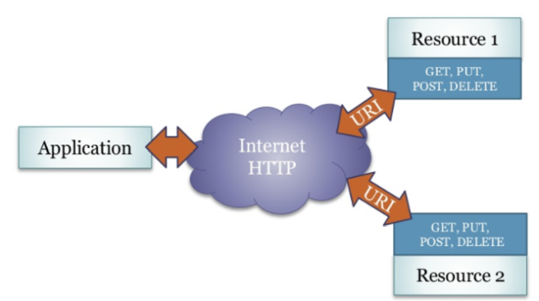

REST
----

 

- - -

[Representational State Transfer (abgekürzt REST, seltener auch ReST)](http://de.wikipedia.org/wiki/Representational_State_Transfer) bezeichnet ein Programmierparadigma für verteilte Systeme.

REST ist eine Abstraktion der Struktur und des Verhaltens des World Wide Web (HTTP GET, PUT, POST, DELETE). 

REST hat das Ziel, einen Architekturstil zu schaffen, der die Anforderungen des modernen Web besser darstellt. Dabei unterscheidet sich REST vor allem in der Forderung nach einer einheitlichen Schnittstelle von anderen Architekturstilen.

**Wird über HTTP zugegriffen, entsprechen die REST Operationen den HTTP-Abfragemethoden.**

### Links

* [ProgrammableWeb](https://www.programmableweb.com/)
* [GitLab REST API](https://docs.gitlab.com/ce/api/README.html)
