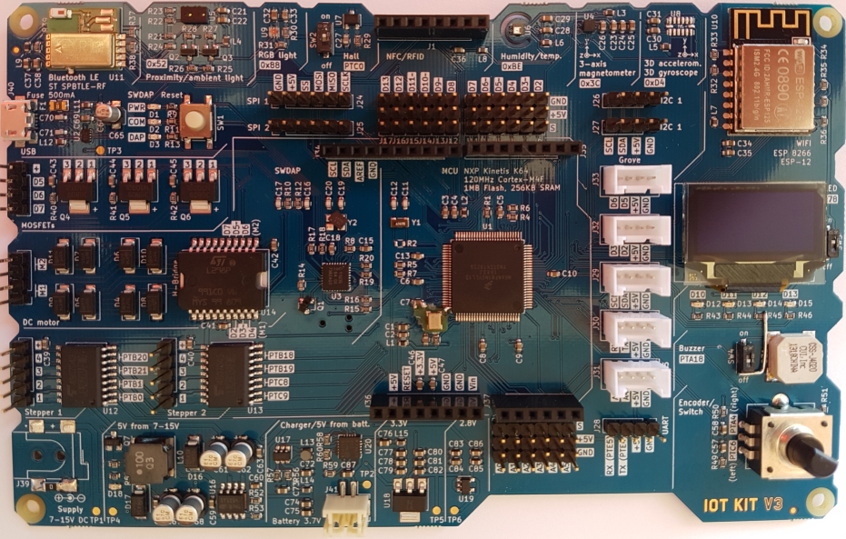

IoTKitV3
========

- - -

IoTKit V3 Beispiele und Dokumentation

## Grundlagen

* [Hardware](hw/)
* [Software und Installation](sw/)
* [Kleine C/C++ Einführung](ccpp/)
* [GPIO](gpio/)
* [Das Konfigurationssystem (GPIO Belegungen)](config/)
* [Sensoren](sensors/)
* [Aktoren](actors/)

## Bus Systeme

* [UART](uart/)
* [I²C/TWI](i2c/)
* [SPI](spi/)

## WLAN (WiFi) / Bluetooth

* [WLAN (WiFi)](wlan/)
* [Bluetooth](bluetooth/)

### Internet IoT Protokolle

* [Sockets (TCP/UDP)](tcpip/)
* [HTTP](http/)
* [MQTT](mqtt/)
* [CoAP](coap/)

## Anwendungen

* [Cloud Dienste](cloud/) wie IFTTT, Yahoo Weather
* [Industrie V4.0](industrieV4/)
* [Roboter](roboter/)
* [NFC / RFID](rfid/)
* [Workflow](workflow/)
* [Built with Mbed](https://www.mbed.com/built-with-mbed/)

## Erweiterungen

Für die nachfolgenden Erweiterten Beispiele wird evtl. zusätzliche HW, wie z.B. ein Data Logging Shield, benötigt.

* [Speicher APIs](storage/)

## Links

* [ARM mbed](https://www.mbed.com)
* [Beispiele von Implementierungen mit mbed OS](https://www.mbed.com/built-with-mbed/)
* [mbed Labs](https://labs.mbed.com/)
* [ARM mbed YouTube Channel](https://www.youtube.com/channel/UCNcxd73dSceKtU77XWMOg8A)
* [Die drei Hauptklassen von IoT](https://www.arm.com/products/iot/soc)
* [Geschäftsmodelle und IoT](https://www.iot-lab.ch/publications/#whitepapers)
* [IoTKit Übersicht alle Versionen](https://github.com/mc-b/IoTKit#internet-der-dinge-kit)

