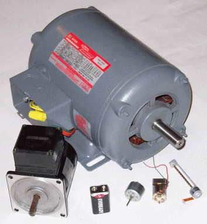

## Gleichstrom Motor (Aktor) 

 

[Motoren](http://de.wikipedia.org/wiki/Elektromotor)

- - -

Elektromotor bezeichnet einen elektromechanischen Wandler (elektrische Maschine), der elektrische Energie in mechanische Energie umwandelt. In herkömmlichen Elektromotoren wird die Kraft, die von einem Magnetfeld auf die stromdurchflossenen Leiter einer Spule ausgeübt wird, in Bewegung umgesetzt.

Der Motor wird mittels eines float Wertes von full Speed rueckwärts (-1.0) nach full Speed vorwärts (1.0) angesprochen.

Ein ruhiger und schonender Motorlauf wird durch die Anpassung der PWM Periode (in Motor.cpp) erreicht. Diese PWM Periode bezieht sich auf die Motor Frequenz (siehe Datenblatt Motor) und wird wie folgt berechnet:

*   Periode (s) = 1 / Frequenz (Hz = 1/s)

Sourcecode aus Motor.cpp

    // Set initial condition of PWM
    _pwm.period( 1.0f / 50000 );

Ein Motor benötigt die [Motor Library](http://developer.mbed.org/users/simon/code/Motor/) und eine Verstärkerschaltung, wie z.B. eine [H-Brücke](http://de.wikipedia.org/wiki/Br%C3%BCckenschaltung). Eine H-Brücke braucht einen PWM Pin und zwei beliebige Digital Pins pro Motor. Es können zwei Motoren an den DCMOT (D2-D7) Header angeschlossen werden.

Für Feintuning des Fahrverhaltens, Geschwindigkeitkennlinien etc. siehe [Digital Decoder](http://www.esu.eu/download/betriebsanleitungen/digitaldecoder/) bei der Modelleisenbahn.

### Anwendungen 

*   Antrieb von Bahnen, Elektrokarren, Gabelstabel, Funkgesteuerte Modellautos (RC-Car), Robotern etc.

### Links 

*   [Messung der Stromaufnahme des gesteuerten Motors](http://rn-wissen.de/wiki/index.php?title=Getriebemotoren_Ansteuerung#Messung_der_Stromaufnahme_des_gesteuerten_Motors)
*  [Arm Mbed Online Compiler](https://os.mbed.com/compiler/#import:/teams/IoTKitV3/code/Motor/)
