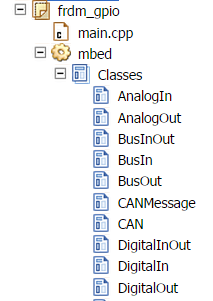

## Programmbibliotheken (Libraries)

Ein oder mehrere Klassen werden in Programmbibliotheken (Libraries) zusammenfasst.

Programmbibliotheken (Libraries) werden, von der mbed Plattform (IDE, Compiler), in Repositories gespeichert.

Beispiel Klassen und Programmbibliotheken (Libraries)

 

*   mbed ist eine Programmbibliothek (Library) welche die Grundklassen der mbed Plattform beinhaltet
*   AnalogIn, DigitalOut etc. sind Klassen.

Weitere Beispiele siehe [mbed Komponenten Verzeichnis](http://developer.mbed.org/components/)