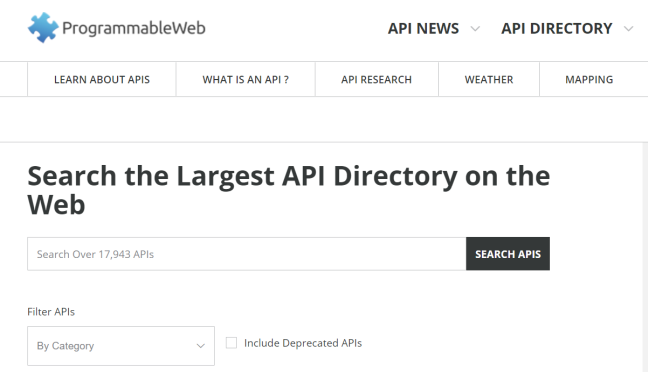

## Cloud Dienste

- - -

In der Cloud stehen einen Reihe von Services zur Verfügung womit die Boards mit Steuerungsinformationen, wie Sonnen Auf- und Untergang, Wetterentwicklung etc. versorgt werden können.

Die gebräuchlichsten Format sind HTML, [XML](http://de.wikipedia.org/wiki/Extensible_Markup_Language) oder [JSON (JavaScript Object Notation)](http://de.wikipedia.org/wiki/JavaScript_Object_Notation).

[ProgrammableWeb](http://www.programmableweb.com/apis/directory) liefert eine Übersicht dieser Dienste.

### Anwendungen 

*   Intelligente Dämmerungsschaltung mit Berücksichtigung Sonnen Auf- und Untergang
*   Intelligente, Vorausschauende Heizung, z.B. Heizung nicht aktivieren, wenn Sonnenschein angekündigt ist
*   Vorbeugung von Unwetterschäden, z.B. durch Einfahren der Sonnenstoren bei aufkommenden Sturm

### Beispiele (mbed OS V2.x - ca. V5.3)

**Grundlagen**

* [XML](XMLParser/) 
* [JSON](JSONParser/)

**Cloud Services**

* [Yahoo Weather](YahooWeather/) 
* [Sunrise Sunset](SunriseSunset/)

**IFTTT**

* [Beschreibung](HallSensorAlarm/README.md)
* [Notfall Armband](FXOS8700QV2Alarm/)
* [Fenstersicherung (Hall Sensor)](HallSensorAlarm/)
* [Hausautomation und IFTTT](HouseAutomation/)

