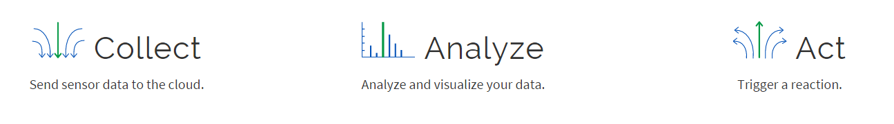

## Cloud Dienste
***

> [⇧ **Home**](../README.md)


- - -


In der Cloud stehen einen Reihe von Services zur Verfügung womit die Boards mit Steuerungsinformationen, wie Sonnen Auf- und Untergang, Wetterentwicklung etc. versorgt werden können.

Die gebräuchlichsten Format sind HTML, [XML](http://de.wikipedia.org/wiki/Extensible_Markup_Language) oder [JSON (JavaScript Object Notation)](http://de.wikipedia.org/wiki/JavaScript_Object_Notation).

[ProgrammableWeb](http://www.programmableweb.com/apis/directory) liefert eine Übersicht dieser Dienste.

### Anwendungen 

*   Intelligente Dämmerungsschaltung mit Berücksichtigung Sonnen Auf- und Untergang
*   Intelligente, Vorausschauende Heizung, z.B. Heizung nicht aktivieren, wenn Sonnenschein angekündigt ist
*   Vorbeugung von Unwetterschäden, z.B. durch Einfahren der Sonnenstoren bei aufkommenden Sturm

### Beispiele 

**Grundlagen**

* [JSON](#json-javascript-object-notation)
* [XML](#xml-extensible-markup-language) 

**Cloud Services**

* [Sunrise Sunset](#sunset-sunrise-json)
* [IFTTT](#ifttt-if-this-then-that)
* [ThinkSpeak](#thingspeak)
* [Yahoo Weather](#yahoo-wetter-xmlrss-feed) 

## JSON (JavaScript Object Notation)
***

> [⇧ **Nach oben**](#)

```js
{ "my_array": [ "demo_string", 10], 
              "my_boolean": true }                              

```

Beispiel JSON Code

- - -

```js
label: [ string, int ],
          label: int              
```

Abbildung JSON Code im Speicher 

- - - 

Die [JavaScript Object Notation, kurz JSON](http://de.wikipedia.org/wiki/JavaScript_Object_Notation), ist ein kompaktes Datenformat in einer einfach lesbaren Textform zum Zweck des Datenaustauschs zwischen Anwendungen. Jedes gültige JSON-Dokument soll ein gültiges JavaScript sein und per eval() interpretiert werden können. JSON ist unabhängig von der Programmiersprache. Parser existieren in praktisch allen verbreiteten Sprachen.

Mittels der [MbedJSONValue](http://developer.mbed.org/users/samux/code/MbedJSONValue/) Library können JSON Strukturen geparst oder erzeugt werden.

### Beispiel(e)

Das Beispiel [JSONParser](JSONParser/src/main.cpp) erzeugt eine JSON Struktur und parst diese nach C++.

**Compilieren**

| Umgebung/Board    | Link/Befehl                      |
| ----------------- | -------------------------------- |
| Online Compiler | [JSONParser](https://os.mbed.org/compiler/#import:/teams/smdiotkit2ch/code/JSONParser/) |
| CLI (IoTKit K64F) | `mbed compile -m K64F --source . --source ../IoTKitV3/cloud/JSONParser; ` <br> `cp BUILD/K64F/GCC_ARM/template.bin $DAPLINK` |
| CLI (DISCO_L475VG_IOT01A) | `mbed compile -m DISCO_L475VG_IOT01A -f --source . --source ../IoTKitV3/cloud/JSONParser` |


## XML (Extensible Markup Language)
***

> [⇧ **Nach oben**](#)

```xml
<a>
    <b>
        <c>
            <d c="123">eins</d>
            <e>zwei</e>
            <f>drei</f>
        </c>
    </b>
</a>
```

Beispiel XML Code 

- - -

```xml
SP_XmlDocument a
    SP_XmlElementNode b
        SP_XmlElementNode c
            SP_XmlElementNode d c=123
                SP_XmlCDataNode eins
            SP_XmlElementNode e 
                SP_XmlCDataNode zwei
            SP_XmlElementNode f
                SP_XmlCDataNode drei               
```

Abbildung XML Code im Speicher

- - -

Die [Extensible Markup Language (engl. „erweiterbare Auszeichnungssprache“)](http://de.wikipedia.org/wiki/Extensible_Markup_Language), abgekürzt XML, ist eine Auszeichnungssprache zur Darstellung hierarchisch strukturierter Daten in Form von Textdateien. XML wird u. a. für den plattform- und implementationsunabhängigen Austausch von Daten zwischen Computersystemen eingesetzt, insbesondere über das Internet.

Mittels der [spxml (Simple Plain Xml parser)](http://developer.mbed.org/users/hlipka/code/spxml/) Library können XML Strukturen geparst und anschliessend traversiert werden.

### Beispiel(e)

Das Beispiel [XMLParser](XMLParser/src/main.cpp) erzeugt eine XML Struktur und parst diese nach C++.

**Compilieren**

| Umgebung/Board    | Link/Befehl                      |
| ----------------- | -------------------------------- |
| Online Compiler | [XMLParser](https://os.mbed.org/compiler/#import:/teams/smdiotkit2ch/code/XMLParser/) |
| CLI (IoTKit K64F) | `mbed compile -m K64F --source . --source ../IoTKitV3/cloud/XMLParser; ` <br> `cp BUILD/K64F/GCC_ARM/template.bin $DAPLINK` |
| CLI (DISCO_L475VG_IOT01A) | `mbed compile -m DISCO_L475VG_IOT01A -f --source . --source ../IoTKitV3/cloud/XMLParser` |

## Sunset Sunrise (JSON)
***

> [⇧ **Nach oben**](#)


- - -

Sunrise Sunset stellt ein API zur Verfügung, mittels dem die Sonnen Auf- und Untergangszeiten für einen bestimmten Ort abgefragt werden können.

**Links**

*   [Website](http://sunrise-sunset.org/)
*   [API Beschreibung](http://sunrise-sunset.org/api)
*   [Sonnen Auf- und Untergang für Zürich](http://sunrise-sunset.org/search?location=Z%C3%BCrich%2C+Schweiz)

### Beispiel: Abfrage für Zürich 

[http://api.sunrise-sunset.org/json?lat=47.3686498&amp;lng=8.5391825](http://api.sunrise-sunset.org/json?lat=47.3686498&lng=8.5391825)

```js
{"results":
   { "sunrise":"5:38:12 AM",
     "sunset":"5:31:12 PM",
     "solar_noon":"11:34:42 AM",
     "day_length":"11:53:00",
     "civil_twilight_begin":"5:07:47 AM",
     "civil_twilight_end":"6:01:38 PM",
     "nautical_twilight_begin":"4:32:04 AM",
     "nautical_twilight_end":"6:37:21 PM",
     "astronomical_twilight_begin":"3:55:32 AM",
     "astronomical_twilight_end":"7:13:52 PM"
   },
   "status":"OK"}
```

### Beispiel(e)

Das Beispiel [SunriseSunset](SunriseSunset/src/main.cpp) holt die Informationen für Sonnenauf- und Untergang von http://sunrise-sunset.org

**Compilieren**

| Umgebung/Board    | Link/Befehl                      |
| ----------------- | -------------------------------- |
| Online Compiler | [SunriseSunset](https://os.mbed.com/compiler/#import:/teams/IoTKitV3/code/SunriseSunset/) |
| CLI (IoTKit K64F) | `mbed compile -m K64F --source . --source ../IoTKitV3/cloud/SunriseSunset; ` <br> `cp BUILD/K64F/GCC_ARM/template.bin $DAPLINK` |
| CLI (DISCO_L475VG_IOT01A) | `mbed compile -m DISCO_L475VG_IOT01A -f --source . --source ../IoTKitV3/cloud/SunriseSunset` |


## IFTTT ("If This Then That")
***

> [⇧ **Nach oben**](#)


- - -

IFTTT (die Abkürzung von "If This Then That") ist ein Dienstanbieter, der es Benutzern erlaubt, verschiedene Webanwendungen (zum Beispiel Facebook, Evernote, Dropbox usw.) mit einfachen Bedingten Anweisungen zu verknüpfen..

IFTTT ermöglicht Benutzern "Applets" nach dem Motto "If this then that" ("Wenn dies dann das") zu verknüpfen

*   Der "this"-Teil eines Applets wird "Trigger"
*   Der "that"-Teil eines Applets wird Aktion genannt.

Die eigentlichen Geräte / Dienste werden als **Services** bezeichnet.

### Webhook Service 

Der [Webhook Service](https://ifttt.com/maker_webhooks) ermöglicht es, IFTTT mit dem IoTKit zu verbinden.

Mit dem Webhook Service kann die IFTTT Plattform HTTP Aufrufe empfangen (Triggers) und Aktionen (Actions) auslösen.

### IFTTT einrichten und Applet erstellen 

**Um eine Aktion mittels Web Request auslösen:**

In dieser Variante löst das IoTKit einen Event mittels `HTTP GET` aus, welcher z.B. weiter an ein Smartphone geleitet wird um Musik abzuspielen.

* `New Applet` anwählen
* **if:** `Webhooks` und `receive a web request` wählen und Event-Name erfassen.
* **then:** `Add action`, z.B. `Android Device` und `Play a ...` wählen
* Name vergeben und speichern.
* Service `Webhooks` suchen und `Documentation`, oben rechts, anwählen. 
* Es erscheint eine Seite mit der Beschreibung `URL`, `API-Key` wie der Service aufgerufen werden kann. Der Aufruf ist in etwa wie folgt:

```cpp
    curl https://maker.ifttt.com/trigger/<Event-Name>/with/key/<your key>
```

Nach dem Ersetzen des Event-Names, durch den oben erfassten Event-Name, kann der URL 1:1 in das main.cpp in die Variable `finishMsg` übertragen werden.
Das Programm compilieren. Wird nun ein Magnet über den Hall-Sensor geführt, wird der Alarm ausgelöst, ein HTTP an die IFTTT Plattform gesendet welche diese weiter an die Aktion leitet.

### Beispiel(e)

Das Beispiel [HallSensorAlarm](HallSensorAlarm/src/main.cpp) löst eine Aktion auf der IFTTT Plattform aus, wenn jemand einen Magneten an den Hallsensor hält.

**Compilieren**

| Umgebung/Board    | Link/Befehl                      |
| ----------------- | -------------------------------- |
| Online Compiler | [HallSensorAlarm](https://os.mbed.com/compiler/#import:/teams/IoTKitV3/code/HallSensorAlarm/) |
| CLI (IoTKit K64F) | `mbed compile -m K64F --source . --source ../IoTKitV3/cloud/HallSensorAlarm; ` <br> `cp BUILD/K64F/GCC_ARM/template.bin $DAPLINK` |
| CLI (DISCO_L475VG_IOT01A) | `mbed compile -m DISCO_L475VG_IOT01A -f --source . --source ../IoTKitV3/cloud/HallSensorAlarm` |


## ThingSpeak
***

> [⇧ **Nach oben**](#)




- - -

ThingSpeak ist eine "Internet der Dinge" Anwendung um Daten zu sammeln, analysieren und mittels Triggern darauf zu reagieren.

Um ThingSpeak verwenden zu könnnen ist zuerst ein Login [SigUp](https://thingspeak.com/) zu lösen und anschliessend ein neuer Channel mit folgenden Feldern einzurichten:

*   Field 1: Temp
*   Field 2: Hum

Auf den **Data Import / Export** Tab zu wechseln und die Variablen _host_ und _key_ entsprechend den **Update Channel Feed - POST (rechts)** Angaben anzupassen.

Programm compilieren und auf das Board downloaden. Unter **Private View** sollten zwei Grafiken mit den aktuellen Sensorwerten sichtbar werden.

**Links**

*   [ThingSpeak Channel](https://thingspeak.com/channels/82291) 
*   [Website](https://thingspeak.com/)
*   [Einführung in ThingSpeak](http://www.codeproject.com/Articles/845538/An-Introduction-to-ThingSpeak)
*   [ThingSpeak im Praxistest](http://blog.zuehlke.com/die-iot-plattform-thingspeak-im-praxistest/)

### Beispiel(e)

Das Beispiel [ThingSpeak](ThingSpeak/src/main.cpp) schickt Sensordaten an den ThingSpeak Cloud Dienst.

**Compilieren**

| Umgebung/Board    | Link/Befehl                      |
| ----------------- | -------------------------------- |
| Online Compiler | [ThingSpeak](https://os.mbed.com/compiler/#import:/teams/IoTKitV3/code/ThingSpeak/) |
| CLI (IoTKit K64F) | `mbed compile -m K64F --source . --source ../IoTKitV3/cloud/ThingSpeak; ` <br> `cp BUILD/K64F/GCC_ARM/template.bin $DAPLINK` |
| CLI (DISCO_L475VG_IOT01A) | `mbed compile -m DISCO_L475VG_IOT01A -f --source . --source ../IoTKitV3/cloud/ThingSpeak` |


## Yahoo Wetter (XML/RSS-Feed)
***

> [⇧ **Nach oben**](#)


- - -

Mittels Yahoo Weather kann das aktuelle Wetter und eine Vorhersage für einen Bestimmten Ort abgefragt werden.

**ACHTUNG**: der Dienst ändert relativ oft, so kann die Funktion des Beispiel nicht gewährleistet werden, bzw. muss URL und Format evtl. angepasst werden.

**Links**

*   [Website](https://weather.yahoo.com/)
*   [API](https://developer.yahoo.com/weather/)
*   [Where On Earth ID (WOEID) Suche](http://zourbuth.com/tools/woeid/)

### Beispiel: Abfrage für Zürich 

Aufruf mittels curl

```xml
    curl http://query.yahooapis.com/v1/public/yql  \
           -d q="select * from weather.forecast where woeid=784794"    -d format=xml                        
```

```xml
<?xml version="1.0" encoding="UTF-8"?>
<query xmlns:yahoo="http://www.yahooapis.com/v1/base.rng" yahoo:count="1" yahoo:created="2016-07-22T13:17:05Z"
    yahoo:lang="en-US">
    <results>
        <channel>
            <yweather:units xmlns:yweather="http://xml.weather.yahoo.com/ns/rss/1.0" distance="mi" pressure="in"
                speed="mph" temperature="F" />
            <title>Yahoo! Weather - Zurich, ZH, CH</title>
            <link>http://us.rd.yahoo.com/dailynews/rss/weather/Country__Country/*https://weather.yahoo.com/country/state/city-784794/</link>
            <description>Yahoo! Weather for Zurich, ZH, CH</description>
            <language>en-us</language>
            <lastBuildDate>Fri, 22 Jul 2016 03:17 PM CEST</lastBuildDate>
            <ttl>60</ttl>
            <yweather:location xmlns:yweather="http://xml.weather.yahoo.com/ns/rss/1.0" city="Zurich"
                country="Switzerland" region=" ZH" />
            <yweather:wind xmlns:yweather="http://xml.weather.yahoo.com/ns/rss/1.0" chill="72" direction="150"
                speed="11" />
            <yweather:atmosphere xmlns:yweather="http://xml.weather.yahoo.com/ns/rss/1.0" humidity="72"
                pressure="957.0" rising="0" visibility="16.1" />
            <yweather:astronomy xmlns:yweather="http://xml.weather.yahoo.com/ns/rss/1.0" sunrise="5:54 am"
                sunset="9:10 pm" />
            <image>
                <title>Yahoo! Weather</title>
                <width>142</width>
                <height>18</height>
                <link>http://weather.yahoo.com</link>
                <url>http://l.yimg.com/a/i/brand/purplelogo//uh/us/news-wea.gif</url>
            </image>
            <item>
                <title>Conditions for Zurich, ZH, CH at 02:00 PM CEST</title>
                <geo:lat xmlns:geo="http://www.w3.org/2003/01/geo/wgs84_pos#">47.38427</geo:lat>
                <geo:long xmlns:geo="http://www.w3.org/2003/01/geo/wgs84_pos#">8.52959</geo:long>
                <link>http://us.rd.yahoo.com/dailynews/rss/weather/Country__Country/*https://weather.yahoo.com/country/state/city-784794/</link>
                <pubDate>Fri, 22 Jul 2016 02:00 PM CEST</pubDate>
                <yweather:condition xmlns:yweather="http://xml.weather.yahoo.com/ns/rss/1.0" code="39"
                    date="Fri, 22 Jul 2016 02:00 PM CEST" temp="72" text="Scattered Showers" />
                <yweather:forecast xmlns:yweather="http://xml.weather.yahoo.com/ns/rss/1.0" code="4" date="22 Jul 2016"
                    day="Fri" high="77" low="66" text="Thunderstorms" />
                <yweather:forecast xmlns:yweather="http://xml.weather.yahoo.com/ns/rss/1.0" code="47" date="23 Jul 2016"
                    day="Sat" high="76" low="64" text="Scattered Thunderstorms" />
                <yweather:forecast xmlns:yweather="http://xml.weather.yahoo.com/ns/rss/1.0" code="39" date="24 Jul 2016"
                    day="Sun" high="78" low="63" text="Scattered Showers" />
                <yweather:forecast xmlns:yweather="http://xml.weather.yahoo.com/ns/rss/1.0" code="47" date="25 Jul 2016"
                    day="Mon" high="77" low="64" text="Scattered Thunderstorms" />
                <yweather:forecast xmlns:yweather="http://xml.weather.yahoo.com/ns/rss/1.0" code="47" date="26 Jul 2016"
                    day="Tue" high="75" low="64" text="Scattered Thunderstorms" />
                <yweather:forecast xmlns:yweather="http://xml.weather.yahoo.com/ns/rss/1.0" code="4" date="27 Jul 2016"
                    day="Wed" high="75" low="61" text="Thunderstorms" />
                <yweather:forecast xmlns:yweather="http://xml.weather.yahoo.com/ns/rss/1.0" code="30" date="28 Jul 2016"
                    day="Thu" high="76" low="60" text="Partly Cloudy" />
                <yweather:forecast xmlns:yweather="http://xml.weather.yahoo.com/ns/rss/1.0" code="30" date="29 Jul 2016"
                    day="Fri" high="79" low="59" text="Partly Cloudy" />
                <yweather:forecast xmlns:yweather="http://xml.weather.yahoo.com/ns/rss/1.0" code="39" date="30 Jul 2016"
                    day="Sat" high="80" low="58" text="Scattered Showers" />
                <yweather:forecast xmlns:yweather="http://xml.weather.yahoo.com/ns/rss/1.0" code="30" date="31 Jul 2016"
                    day="Sun" high="78" low="59" text="Partly Cloudy" />
                <description></description>
                <guid isPermaLink="false" />
            </item>
        </channel>
    </results>
</query>
```

### Beispiel(e)

Das Beispiel [YahooWheater](YahooWheater/src/main.cpp) holt die Wetterdaten von Yahoo.

**Compilieren**

| Umgebung/Board    | Link/Befehl                      |
| ----------------- | -------------------------------- |
| CLI (IoTKit K64F) | `mbed compile -m K64F --source . --source ../IoTKitV3/cloud/YahooWheater; ` <br> `cp BUILD/K64F/GCC_ARM/template.bin $DAPLINK` |
| CLI (DISCO_L475VG_IOT01A) | `mbed compile -m DISCO_L475VG_IOT01A -f --source . --source ../IoTKitV3/cloud/YahooWheater` |


