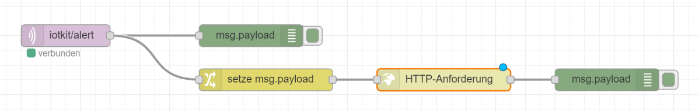
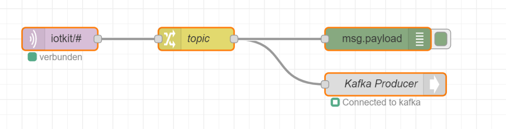

## Edge Computing

Edge Computing bezeichnet im Gegensatz zum Cloud Computing die dezentrale Datenverarbeitung am Rand des Netzwerks, der sogenannten Edge (engl. für Rand oder Kante).

Dazu kommen Cloud Technologien, wie Docker und Kubernetes, zum Einsatz

## Raspberry Pi (2, 3) als Edge aufsetzen

Der Raspberry Pi (2, 3) eignet sich als Edge. 

Dazu ist der Raspbery Pi (2, 3) wie folgt aufzusetzen:

* Raspbian Lite wie auf [raspberrypi.org](https://www.raspberrypi.org/) beschrieben, downloaden und auf SD Karte speichern.
* Auf der SD Karte eine Datei «ssh» ohne Endung erstellen.
* Auf Windows Git/Bash oder Putty o.ä. installieren. Mac und Linux brauchen nur Git.
* Raspberry Pi via Kabel mit dem Router LERNKUBE verbinden und via ssh Verbinden
    
Grundinstallation:
  
    ssh 192.168.2.xx -l pi
    PW: raspberry
    WLAN, Zeitzone etc. in raspi-config Einstellen
    sudo raspi-config

Quelle: https://howtoraspberrypi.com/how-to-raspberry-pi-headless-setup/ 

Anschliessend bietet sich [Docker](https://docker.com) als Container Umgebung an. Docker kann wie folgt installiert werden:

    ssh 192.168.2.xx -l pi
    sudo -i
    cd /tmp
    wget -O get-docker.sh http://get.docker.com
    sh get-docker.sh
    sudo usermod -aG docker pi
    exit

Testen der Docker Umgebung:

    ssh 192.168.2.xx -l pi
    docker run hello-world
    
Nach der Installation der benötigten Grundinfrastruktur können wir loslegen und die eigentliche Software als Container starten.

Wir verwenden wie im [Workflow Beispiel](../workflow) [Node-RED](https://nodered.org/) und Mosquitto und bauen das Beispiel dann Stück für Stück aus.

    docker run -d -p 1880:1880 nodered/node-red
    docker run -d -p 1883:1883 eclipse-mosquitto
    
Die eigentliche Applikation Node-RED ist via Browser <IP-Raspberry Pi:1880> zugreifbar.

## Raspberry Pi (4) als Edge aufsetzen

Grundsätzlich kann der Raspberry Pi 4 wie die Version 2, 3 installiert werden. Aber statt Docker installieren wir, die leichtgewichtige Kubernetes Variante [k3s](https://k3s.io/).

Installationsschritte wie oben aber ohne Docker ausführen, stattdessen installieren wir [k3s](https://k3s.io/).

    #   Installiert Rancher k3s ohne Ingress Controller traefik
    curl -sfL https://get.k3s.io | INSTALL_K3S_EXEC="--no-deploy=traefik" sh -s -

    # pi User als Admin zulassen
    sudo mkdir -p /home/pi/.kube
    sudo cp /etc/rancher/k3s/k3s.yaml /home/pi/.kube/config
    sudo chown -R pi:pi /home/pi/.kube
    sudo chmod 700 /home/pi/.kube
    sudo echo 'export KUBECONFIG=$HOME/.kube/config' >>/home/pi/.bashrc 
    
Optional lohnt es sich dem Raspberry Pi ein Web-UI zu spendieren. Das vereinfacht den Zugriff auf die Kubernetes Ressourcen.

    # Apache Server als Web UI installieren
    sudo apt install -y apache2 jq markdown
    sudo a2enmod cgi
    sudo systemctl restart apache2

    # Web-UI einrichten
    git clone https://github.com/mc-b/IoTKitV3
    cd IoTKitV3/edge/
    sudo cp cgi-bin/* /usr/lib/cgi-bin/
    sudo chmod +x /usr/lib/cgi-bin/*
    sudo cp html/* /var/www/html/
    
    # www-data User Zugriff auf Kubernetes erlauben
    sudo mkdir -p /var/www/.kube
    sudo cp /etc/rancher/k3s/k3s.yaml /var/www/.kube/config
    sudo chown -R www-data:www-data /var/www/.kube
    sudo chmod 700 /var/www/.kube    
   
Nach der Installation der benötigten Grundinfrastruktur können wir loslegen und die eigentliche Software als Container starten.

Wir verwenden wie im [Workflow Beispiel](../workflow) [Node-RED](https://nodered.org/) und Mosquitto und bauen das Beispiel dann Stück für Stück aus.
    
    # IoT Umgebung 
    kubectl apply -f https://raw.githubusercontent.com/mc-b/duk/master/iot/mosquitto.yaml
    kubectl apply -f https://raw.githubusercontent.com/mc-b/duk/master/iot/nodered.yaml
    
Über welche Ports die Services verfügbar sind kann im Web-UI nachgeschaut oder mittels des nachfolgenden Befehls ermittelt werden:

    kubectl get services
    
Werden mehrere Node-RED Umgebungen benötigt, können diese in neuen Kubernetes Namespaces gestartet werden.   

    kubectl create namespace nr1
    kubectl apply -n nr1 -f https://raw.githubusercontent.com/mc-b/duk/master/iot/nodered.yaml   

## Cloud Umgebung (MQTT - Edge - REST)

Für das *Internet of Everything* brauchen wir noch eine Geschäftsprozess (BPMN) Workflow Umgebung und einen entsprechenden Prozess.

**Variante a) Manuelle Installation**

Installieren von 
* [Camunda BPMN Workflow Engine](https://camunda.com/)
* [Camunda Modeler](https://camunda.com/)
* Download des Rechnungsprozesses vom Projekt [misegr](https://raw.githubusercontent.com/mc-b/misegr/master/bpmn/RechnungStep3.bpmn)
* Import des Rechnungsprozesses [RechnungStep3.bpmn](https://raw.githubusercontent.com/mc-b/misegr/master/bpmn/RechnungStep3.bpmn) in den Modeler
* Export des Rechnungsprozesse vom Modeler in die BPMN Workflow Engine.

**Variante b) in einer Kubernetes Umgebung**

Starten der [Camunda BPMN Workflow Engine](https://camunda.com/). Download Rechnungsprozesses [RechnungStep3.bpmn](https://raw.githubusercontent.com/mc-b/misegr/master/bpmn/RechnungStep3.bpmn). 

    kubectl apply -f https://raw.githubusercontent.com/mc-b/misegr/master/bpmn/camunda.yaml
    wget https://raw.githubusercontent.com/mc-b/misegr/master/bpmn/RechnungStep3.bpmn -O RechnungStep3.bpmn
    
warten bis die Workflow Umgebung gestartet ist und veröffentlichen des Rechnungsprozesses, mittels REST Schnittstelle:

    curl -k -w "\n" \
    -H "Accept: application/json" \
    -F "deployment-name=rechnung" \
    -F "enable-duplicate-filtering=true" \
    -F "deploy-changed-only=true" \
    -F "Rechnung.bpmn=@RechnungStep3.bpmn" \
    https://localhost:30443/engine-rest/deployment/create    
        
Details zu BPMN und dem Prozess [siehe](https://github.com/mc-b/misegr/tree/master/bpmn).

### Node-RED (MQTT - Edge - REST)

- - -

Die MQTT Messages vom IoTKit Board sollen vom MQTT Protokoll in das HTTP/REST Protokoll umgewandelt werden.

Um dies zu Demonstrieren erstellen wir eine Input MQTT Node welche das Topic `iotkit/alert` empfängt, eine Node welche eine JSON Struktur erzeugt und eine Node welche die JSON Daten via HTTP/REST an die BPMN Workflow Umgebung weiterleitet.

* [Mosquitto](https://mosquitto.org/) installieren.
* [Node-RED](https://nodered.org/) installieren.
* In Node-RED
    * `mqtt` Input Node auf Flow 1 platzieren, mit Mosquitto Server verbinden und als Topic `iotkit/alert` eintragen.
    * `debug` Output Node auf Flow 1 platzieren und mit Input Node verbinden - damit können wir die MQTT Messages kontrollieren
    * `change` Node auf Flow 1 platzieren und als `msg.payload` folgenden JSON String `{"variables":{"rnr":{"value":"123","type":"long"},"rbetrag":{"value":"200.00","type":"String"}}}` eintragen.
    * `http request` Node auf Flow 1 platzieren, als Methode `POST` und als URL `http://camunda:8080/engine-rest/process-definition/key/RechnungStep3/start` eintragen
    * Zur Kontrolle ebenfalls eine `debug` noch hinten platzieren.
    * Alle Nodes wie oben in der Grafik verbinden und veröffentlichen (deploy).
* mbed Teil
    * [MQTTPublish](../mqtt#mqtt-publish-beispiel) Beispiel in mbed Compiler importieren und ca. auf Zeile 21 den `hostname` mit der IP-Adresse auswechseln wo der Mosquitto Server läuft. 
    * Programm Compilieren und auf Board laden.
    * Magnet an Hall Sensor halten.
* In Camunda BPMN Workflow Engine [https://localhost:30443/camunda](https://localhost:30443/camunda) (URL kann abweichen, je nach Umgebung) einloggen mittels User/Password `demo/demo`. Bei jedem Alarm welcher vom Board (Hall Sensor) mittels Magneten ausgelöst wird, sollte ein neuer Rechnungsprozess gestartet werden.
    
Details zum BPMN Prozess und der URL wie ein Prozess gestartet werden kann steht im [Frontend](https://github.com/mc-b/misegr/tree/master/bpmn) Beispiel bei `$.post`.

Der Flow zum importieren und anpassen, siehe [Node-RED-REST.json](Node-RED-REST.json).

## Cloud Umgebung (MQTT - Edge - Cloud Messaging) 

In Kubernetes starten wie die benötigten Services:

    # IoT Umgebung 
    kubectl apply -f https://raw.githubusercontent.com/mc-b/duk/master/iot/mosquitto.yaml
    kubectl apply -f https://raw.githubusercontent.com/mc-b/duk/master/iot/nodered.yaml

    # Messaging Umgebung 
    kubectl apply -f https://raw.githubusercontent.com/mc-b/duk/master/kafka/zookeeper.yaml
    kubectl apply -f https://raw.githubusercontent.com/mc-b/duk/master/kafka/kafka.yaml

    # Kafka Streams 
    kubectl apply -f https://raw.githubusercontent.com/mc-b/iot.kafka/master/iot-kafka-alert.yaml
    kubectl apply -f https://raw.githubusercontent.com/mc-b/iot.kafka/master/iot-kafka-consumer.yaml
    kubectl apply -f https://raw.githubusercontent.com/mc-b/iot.kafka/master/iot-kafka-pipe.yaml

### Node-RED (MQTT - Edge - Cloud Messaging)

- - -

Die MQTT Messages sollen nun an [Apache Kafka](https://kafka.apache.org/) weitergeleitet werden. Das hat den Vorteil, dass wir diese
* in andere Formate, z.B. von Binär nach JSON, umwandeln können
* sie Persistieren können
* ein Eventlog erhalten
* etc.

Um [Apache Kafka](https://kafka.apache.org/) anzusprechen brauchen wir ein paar zusätzliche Plugins.

Diese können in Node-RED mittels Pulldownmenu rechts -> `Palette verwalten`, Tab `Installieren` hinzugefügt werden. Es handelt es sich um die Plugins:
* node-red-contrib-kafka-node-latest - mindestens Version 0.2
* node-red-contrib-kafka-manager - letzte Version

Dadurch erhalten wird neu `Nodes` für die Integration mit [Apache Kafka](https://kafka.apache.org/).    

* In Node-RED
    * `mqtt` Input Node auf Flow 1 platzieren, mit Mosquitto Server verbinden, als Topic `iotkit/#` und bei Output `a String` eintragen.
    * `debug` Output Node auf Flow 1 platzieren und mit Input Node verbinden - damit können wir die MQTT Messages kontrollieren
    * `change` Node auf Flow 1 platzieren und als Regel `Ändern` Wert `msg.topic` von `iotkit/alert` in `broker_message`, weitere Regel hinzufügen und gleich verfahren für `iotkit/sensor` nach `broker_message`.
    * Kafka Producer auf Flow 1 platzieren und mit Kafka Server (kafka:9092) verbinden
    * Alle Nodes wie oben in der Grafik verbinden und veröffentlichen (deploy).

* mbed Teil
    * [MQTTPublish](../mqtt#mqtt-publish-beispiel) Beispiel in mbed Compiler importieren und ca. auf Zeile 21 den `hostname` mit der IP-Adresse auswechseln wo der Mosquitto Server läuft. 
    * Programm Compilieren und auf Board laden.
* Kubernetes    
    * Das Ergebnis kann mittels `logs iot-kafka-consumer`, logs iot-kafka-pipe` angeschaut werden. Dort sollten die MQTT Messages umgewandelt als Kafka Messages erscheinen.
* In Camunda BPMN Workflow Engine [https://localhost:30443/camunda](https://localhost:30443/camunda) (URL kann abweichen, je nach Umgebung) einloggen mittels User/Password `demo/demo`. Bei jedem Alarm welcher vom Board (Hall Sensor) mittels Magneten ausgelöst wird, sollte ein neuer Rechnungsprozess gestartet werden.
    

Topics auslesen, lesen und schreiben auf Topics in Kafka Container, siehe [Projekt duk](https://github.com/mc-b/duk/tree/master/kafka).

Der Flow zum importieren und anpassen, siehe [Node-RED-Kafka.json](Node-RED-Kafka.json).

