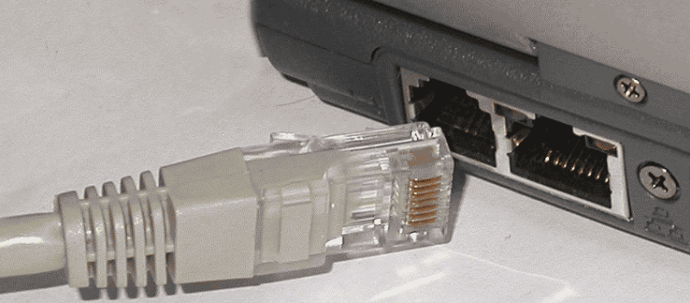

## Ethernet

 

[Notebook Ethernet Anschluss mit Kabel](http://de.wikipedia.org/wiki/Ethernet)

- - -

Ethernet ist eine Technologie, die Software (Protokolle usw.) und Hardware (Kabel, Verteiler, Netzwerkkarten usw.) für kabelgebundene Datennetze spezifiziert, welche ursprünglich für lokale Datennetze (LANs) gedacht war und daher auch als LAN-Technik bezeichnet wird. Sie ermöglicht den Datenaustausch in Form von Datenframes zwischen den in einem lokalen Netz (LAN) angeschlossenen Geräten (Computer, Drucker und dergleichen). Derzeit sind Übertragungsraten von 10 Megabit/s, 100 Megabit/s (Fast Ethernet), 1000 Megabit/s (Gigabit-Ethernet), 10, 40 und 100 Gigabit/s spezifiziert. In seiner ursprünglichen Form erstreckt sich das LAN dabei nur über ein Gebäude; Ethernet über Glasfaser hat eine Reichweite von 10 km und mehr.

Die Ethernet-Schnittstelle ermöglicht mbed Mikrocontrollern sich mit einem Ethernet-Netzwerk zu verbinden, um mit anderen Geräten in einem Netzwerk zu kommunizieren, einschliesslich dem Internet, E-Mail oder Web Servern.

Auf dem FRDM-K64F Board ist der Ethernet Anschluss integriert und benötigt die [Ethernet Library](http://developer.mbed.org/users/mbed_official/code/EthernetInterface/) .

### Anwendungen 

*   Kommunikation mit dem anderen Geräten, Anwendern, Servern etc., via TCP/IP

### Links

*  [mbed OS V2 Variante](https://developer.mbed.org/compiler/#import:/teams/smdiotkitch/code/Ethernet/)
