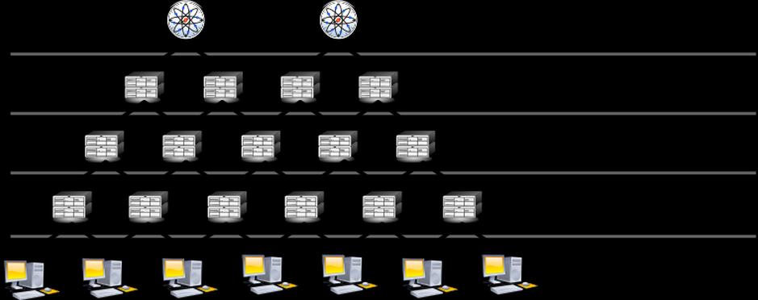

## Network Time Protocol (NTP)

 

NTP Hierarchie, Quelle: [Wikipedia](http://de.wikipedia.org/wiki/Network_Time_Protocol)

- - -

Das Network Time Protocol (NTP) ist ein Standard zur Synchronisierung von Uhren in Computersystemen über paketbasierte Kommunikationsnetze. NTP verwendet das verbindungslose Transportprotokoll UDP. NTP wurde speziell entwickelt, um eine zuverlässige Zeitangabe über Netzwerke mit variabler Paketlaufzeit zu ermöglichen.

Im allgemeinen Sprachgebrauch bezeichnet NTP sowohl das Protokoll als auch die Software-Referenzimplementierung.

NTP nutzt ein hierarchisches System verschiedener Strata (Plural von Stratum). Als Stratum 0 bezeichnet man das Zeitnormal, beispielsweise eine Atomuhr oder eine Funkuhr (genauer: Zeitzeichenempfänger) (GNSS, DCF77). Die unmittelbar mit ihm gekoppelten NTP-Server heißen Stratum 1. Jede weitere abhängige Einheit erhält bei der Bezeichnung eine höhere Nummer (Stratum 2, Stratum 3 …).

Das Network Time Protocol ist in der [NTP Library](https://developer.mbed.org/users/donatien/code/NTPClient/) abgebildet.

### Anwendungen 

*   Alle Arten von Zeit basierenden Anwendungen, wie Zeitschaltuhren etc.

