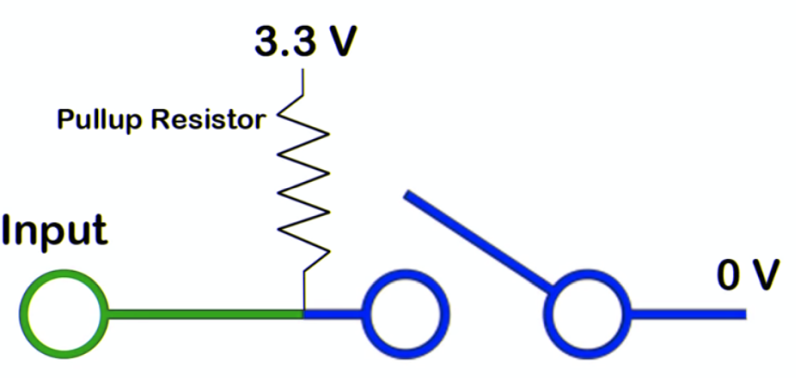

## DigitalIn

- - -

DigitalIn liest den Status eines Pins (als Input Bezeichnet) aus.

DigitalIn liefert je nach Spannung: 0 Volt eine 0 oder 3.3 - 5 Volt eine 1.

Damit Eindeutig zwischen 0 und 1 unterschieden werden kann, wird in der Regel mit PullUp Widerständen gearbeitet. Dies kann durch den internen PullUp Widerstand (zweiter Parameter bei DigitalIn, Default = ON) oder wie beim FRDM-K64F Board (SW2 und SW3), extern erfolgen (siehe unten).

Das Beispiel frägt den Taster vom Encoder ab.

### Anwendungen 

*   Externer Feedback, z.B. Taster.
*   Sensoren welche bei Eintreten eines Ereignisses zwischen 0 und 1 umschalten, z.B. Bewegungsmelder

**Siehe auch:** [mbed Handbook DigitalIn](https://docs.mbed.com/docs/mbed-os-api-reference/en/latest/APIs/io/DigitalIn/) und [YouTube Tutorial](https://www.youtube.com/watch?v=XmWqP8laxxk)

### Links

*  [Arm Mbed Online Compiler](https://os.mbed.com/compiler/#import:/teams/IoTKitV3/code/DigitalIn/)
