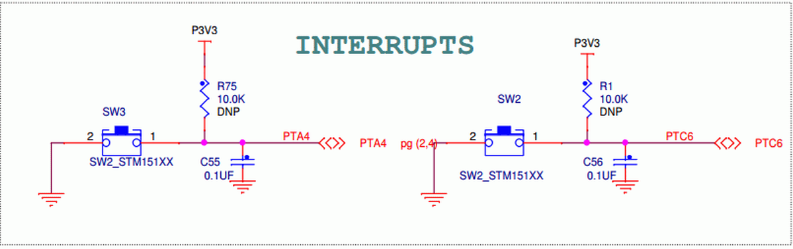

## DigitalIn auf K64F

- - -

DigitalIn mit den 2 Buttons auf dem [FRDM K64F Board](https://developer.mbed.org/platforms/FRDM-K64F/).

### Links

*  [mbed OS V2 Variante](https://developer.mbed.org/compiler/#import:/teams/smdiotkitch/code/DigitalIn/)
