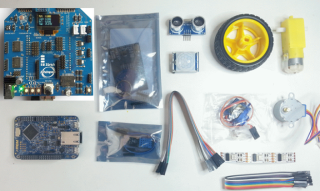
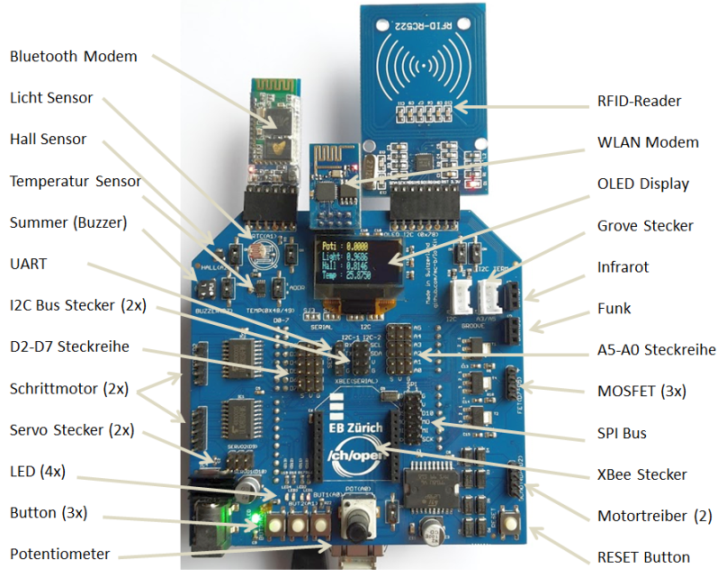
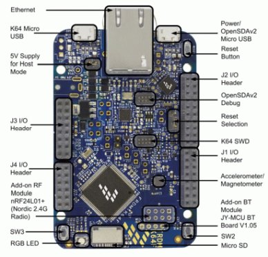

## IoTKit V2

IoTKit V2 Gesamtübersicht

- - -

Der Internet der Dinge Kit V2 besteht aus den nachfolgenden Komponenten.

## Internet der Dinge Shield (SMD Ausführung)

Internet der Dinge Shield

- - -

Der IoTKit ist eine Arduino kompatible Erweiterungsplatine (Shield). Er führt die Pin&#039;s (GPIO) vom Board nach oben und fügt weitere Funktionalitäten hinzu.

Entstanden ist der Shield durch die Kombination einzelner Shields (z.B. Erweiterungsshield, Motorshield etc.). Dadurch sind Pin&#039;s doppelt belegt. Überall wo dies der Fall ist, kann immer nur eine Funktion gleichzeitig genutzt werden. Beispiel ist ein Gleichstrom Motor, am 2\. Anschluss angeschlossen, kann nicht gleichzeitig die MOSFET Verstärkerschaltung genutzt werden, weil sich diese die Pin&#039;s D5 - D7 teilen.

Der Shield verfügt über einen Stromanschluss wo ein Netzteil mit max. 12 Volt Gleichstrom angeschlossen werden kann. Empfohlen wird ein Netzteil mit 9 Volt.

* Schaltplan [Seite 1](IoTKit_Schaltplan1.pdf) und [Seite 2](IoTKit_Schaltplan2.pdf)
* Eagle Dateien [Layout](IOTKit_ch_open_V2.brd), [Schaltplan](IOTKit_ch_open_V2.sch)

## Board

NXP FRDM-K64F Board

- - -

Die Entwicklungsplattform FRDM-K64F ist das Flagschiff von Freescale. Es hat Standard Arduino Headers (d.h. es können Arduino Shields verwendet werden) und ist mbed kompatibel.

Die Entwicklungsplattform beinhaltet eine Vielzahl von Features wie: 256KB RAM, 1MB Flash, Analoge und Digital Ein-/Ausgänge ([GPIO](http://de.wikipedia.org/wiki/Allzweckeingabe/-ausgabe)), Bussysteme wie I2C, SPI, UART, USB Host (OTG), Ethernet, 2 Buttons, 1ne RGB LED etc.

Programmiert wird es in [C++](http://de.wikipedia.org/wiki/C%2B%2B). Andere Programmiersprachen wie Java 8 ME werden ebenfalls unterstützt.

* [Freescale FRDM-K64F Users Manual](http://cache.freescale.com/files/32bit/doc/user_guide/FRDMK64FUG.pdf) 
* [Freescale FRDM-K64F Schematic](http://developer.mbed.org/media/uploads/sam_grove/spf-28163_d.pdf)

## Zubehör

*   **Sensoren** RFID Reader (MFRC-522), PIR Sensor (SR501), Ultrasonic Wave Detector Ranging Module (HC-SR04), Digital Temperature and Humidity Sensor (DHT11), Microswitch Limit Switch: [AliExpress](http://www.aliexpress.com/), [EBay](http://www.ebay.ch/), [Conrad](http://www.conrad.ch/) (teilweise)
*   **Aktoren** 5V Stepper Motor (28BYJ-48), DC Motor, Wheels, 9g Mini Micro Servo (SG90): [AliExpress](http://www.aliexpress.com/), [EBay](http://www.ebay.ch/), [Conrad](http://www.conrad.ch/) (teilweise)
*   **LED Strip&#039;s, Matrix** Led Pixel Strip (WS2801 - Variante mit 4 Adern beachten!), Dot LED Matrix: [AliExpress](http://www.aliexpress.com/), [EBay](http://www.ebay.ch/)
*   **Modems** ESP8266 WLAN Modem, HC-06 Bluetooth Modem, USB To RS232 TTL Konverterkabel: [AliExpress](http://www.aliexpress.com/), [EBay](http://www.ebay.ch/)
*   **IC&#039;s, Transistoren, Widerstände, Kabel, Stecker (Crimp) etc.** [http://www.distrelec.ch/](http://www.distrelec.ch/), [https://www.reichelt.de/](https://www.reichelt.de/), [Pusterla (Ladengeschäft in Zürich)](http://www.pusterla.ch/)

Die restlichen Teile zum Drucken, mittels 3D Drucker, sind auf [http://www.thingiverse.com/](http://www.thingiverse.com/thing:805047) zu finden. Dort befindet sich auch die Dateien um die IoTKit Box, mittels einer CNC Maschine, zu fräsen. Zum Befestigen der Teile werden 2 x M3x20 Linsenschrauben mit Muttern (Schrittmotor ), 1 x M3x30 Linsenschraube mit Mutter (Motorklammer) und zwei Drahtstife (Nägel) mit Durchmesser 1.5mm o.ä. für den Endschalter benötigt.