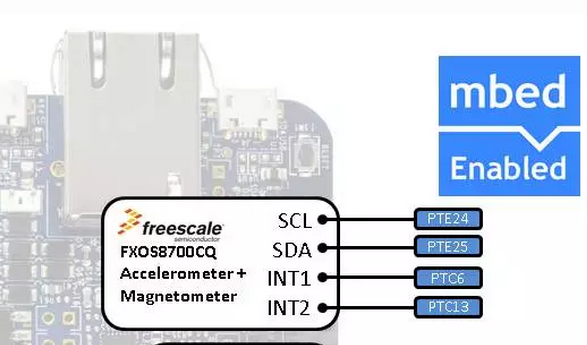

##  6-Achsen-Sensor (I2C)

 

[Anschlussbelegung](https://developer.mbed.org/platforms/FRDM-K64F/#k64f-freedom-sensor-libraries-and)

- - -

Der 6-Achsen-Sensor FXOS8700CQ Xtrinsic kombiniert Beschleunigungsmesser und Magnetfeldstärkenmessgerät und ist Standardmässig auf dem FRDM-K64F Board verbaut.

Zielprodukte sind Smartphones, Tablets, persönliche Navigationsgeräte, Fernbedienungen für Smart-TVs, Uhren, Spiele-Controller, Robotik und unbemannte Luftfahrzeuge (UAVs).

Der FXOS8700CQ benötigt die [FXOS8700CQ Library](http://developer.mbed.org/users/JimCarver/code/FXOS8700Q/).

Der 6-Achsen-Sensor FXOS8700CQ ist fix auf dem FRDM-K64F Board mit 2 Pull-Up Widerständen von 4.7K verbaut. Diese bilden die Endwiderstände für den I2C Bus. Werden diese Weggelassen, z.B. wenn ein anderes Board verwendet wird, ist die Funktionsfähigkeit des I2C Buses nicht gewährleistet.

### Anwendungen 

*   Elektronischer Kompass
*   [Erweiterte Realität (Augmented Reality)](http://de.wikipedia.org/wiki/Erweiterte_Realit%C3%A4t)
*   Standortbezogene Service (statisch geographischen Position), siehe [K64F_eCompass_LCD Beispiel](http://developer.mbed.org/users/JimCarver/code/K64F_eCompass_LCD/)
*   Einfacher Fitness Tracker

### Links

*  [mbed OS V2 Variante](https://developer.mbed.org/compiler/#import:/teams/smdiotkit1ch/code/FXOS8700Q/)
