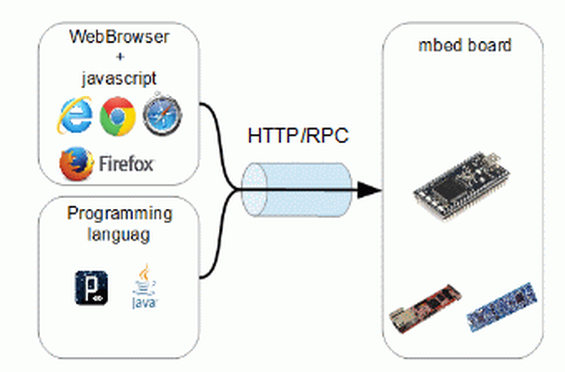
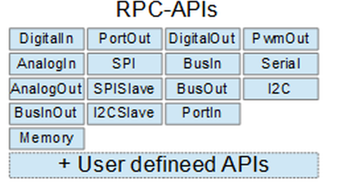

## Einleitung mbed RPC 

 

Funktionsweise

- - -

 

Unterstützte Objekte

- - -

Remote Procedure Call (RPC - „Aufruf einer fernen Prozedur“) ist eine Technik zur Realisierung von Interprozesskommunikation. Sie ermöglicht den Aufruf von Funktionen in anderen Adressräumen. Im Normalfall werden die aufgerufenen Funktionen auf einem anderen Computer als das aufrufende Programm ausgeführt. Es existieren viele Implementierungen dieser Technik, in der Regel sind sie untereinander nicht kompatibel

Die [mbed Plattform](https://developer.mbed.org/cookbook/Interfacing-Using-RPC) beinhaltet eine RPC Library, welche ausgesuchte mbed Objekte (DigitalPin, DigitalOut etc.) mittels [Serieller Schnittstelle](https://developer.mbed.org/teams/smdiotkit2ch/code/RPCHTTPServerVariableSerial/) oder via HTTP Aufrufen, zur Verfügung stellt.

Die mbed RCP Klassen verwenden [C++ Templates](http://de.wikipedia.org/wiki/Template_(Programmierung)), siehe Zeilen mit <_Argument_> und den [Namespace](http://de.wikipedia.org/wiki/Namensraum) RPC, siehe Zeilen mit _RPC::_.

#### Vorgehen 

*   Klasse(n), bzw. deren RPC Variante (Digital = RpcDigitalOut etc.) welche angesprochen werden soll, registrieren
*   Objekte mit den externen Namen definieren
*   RPC Handler im HTTP Server registrieren
*   HTTP Server starten

#### Client 

Aufruf der entsprechenden Objekt-Methode mittels:

	http://<url of mbed>/rpc/<Object name>/<Method name> <Arguments separated by spaces>

z.B. durch Starten des Browser und Eingabe von `http://<IP-Adresse mbed>/rpc/led2/write+1`. Entspricht led2.write(1); led2 wurde vorher mittels DigitalOut led2(D11); instanziert.

Zum lesen kann `http://<IP-Adresse mbed>/rpc/poti/read` verwendet werden.

### Beispiele

* [Einfacher Server](RPCHTTPServerSimple/)
* [Aufruf Funktion](RPCHTTPServerFunction/)
* [Implementierung mittels Variable](RPCHTTPServerVariable/)
* [Smart Home Implementierung](RPCHTTPServerSmartHomeV2/)
* [Kitchen Helper Implementierung](RPCHTTPServerKitchenHelperV2/)
* [Implementierung via Serieller Schnittstelle](RPCHTTPServerVariableSerial/)

