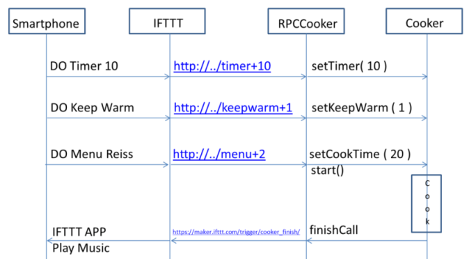

## Kitchen Helper 

- - -

Das Kitchen Helper Projekt simuliert einen "Internet fähigen Kocher kombiniert mit Cloud Services".

Mittels MQTT wird der Kochprozess gestartet und bei Beendigung wird, via IFTTT, eine Meldung an das Smartphone gesendet.

Details siehe [Internet der Dinge (IoT) Orchestrierung](http://iotkit.mc-b.ch/2016-03-04-IoT-Orchestrierung).