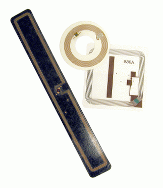

## NFC / RFID 

[RFID Tags](http://de.wikipedia.org/wiki/Near_Field_Communication)

- - -

Die Nahfeld Kommunikation (Near Field Communication, Abkürzung NFC) ist ein internationaler Übertragungsstandard zum kontaktlosen Austausch von Daten per Funktechnik über kurze Strecken von wenigen Zentimetern und einer Datenübertragungsrate von maximal 424 kBit/s. Bisher kommt diese Technik vor allem in Lösungen für Micropayment – bargeldlose Zahlungen kleiner Beträge – zum Einsatz.

Die Übertragung erfolgt entweder verbindungslos (mit passiven HF-RFID-Tags nach ISO 14443 oder ISO 15693) oder Verbindungsbehaftet (zwischen gleichwertigen aktiven Transmittern). Die verbindungslose Nutzung ist nach üblicher Definition (beispielsweise in ISO 15408, den „Common Criteria“) nicht sicher gegen Angriffe von Dritten.

Die Technik hinter NFC basiert auf der englisch [radio-frequency identification (RFID).](http://de.wikipedia.org/wiki/RFID)

### Anwendungen

*   Bargeldloser Zahlungsverkehr (girogo, Paypass, Visa payWave, Google Wallet, Apple Pay etc.)
*   papierlose Eintrittskarten
*   Abrechnung von Beförderungsdienstleistungen (zum Beispiel Touch and Travel)
*   Zugangskontrolle
*   Wächterkontrollsysteme zum Nachweis der Anwesenheit eines NFC-Lesegerätes an einem bestimmten Kontrollpunkt mit montierten oder geklebtes NFC-Tag. Steuerung des Smartphones durch im Handel verfügbare NFC-Tags (z. B. SmartTags von Sony, TecTiles von Samsung, oder universell einsetzbare BluewaveTags)

### Beispiele

* [RFID Reader](RFIDReaderV2/)
* [Inventar mit RFID](RFIDInventar/)
* [Zutrittskontrolle mittels RFID](RFIDZutrittskontrolle/)