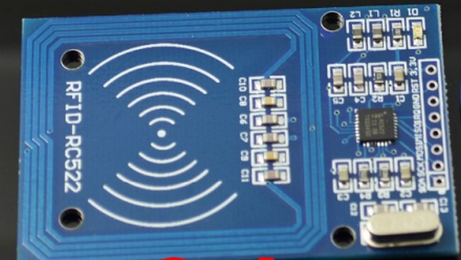

## RFID (Sensor, SPI)

 

[MFRC522 RFID Reader](http://developer.mbed.org/users/AtomX/code/FRDM_MFRC522/) 

- - -

[RFID Tags](http://de.wikipedia.org/wiki/RFID)

- - -

RFID (engl. radio-frequency identification - „Identifizierung mit Hilfe elektromagnetischer Wellen“) bezeichnet eine Technologie für Sender-Empfänger-Systeme zum automatischen und berührungslosen Identifizieren und Lokalisieren von Objekten (Produkte - Lebewesen) mit Radiowellen.

Ein RFID-System besteht aus einem Transponder (umgangssprachlich auch Funketikett genannt), der sich am oder im Gegenstand bzw. Lebewesen befindet und einen kennzeichnenden Code enthält, sowie einem Lesegerät zum Auslesen dieser Kennung.

RFID-Transponder können so klein wie ein Reiskorn sein und implantiert werden, etwa bei Menschen oder Haustieren.

Die Kopplung geschieht durch vom Lesegerät erzeugte magnetische Wechselfelder geringer Reichweite oder durch hochfrequente Radiowellen. Damit werden nicht nur Daten übertragen, sondern auch der Transponder mit Energie versorgt.

Der RFID Reader benötigt die [MFRC522 Library](http://developer.mbed.org/users/AtomX/code/MFRC522/). Der Reader wir via SPI angesprochen. Auf den Shields ist ein entsprechender Steckplatz vorgesehen.

### Eigenschaften (nicht abschliessend)

*   **Frequenzbereich:** RFID kann in Niedrigen Frequenzen (LF, 30–500 kHz) bis zu Mikrowellen-Frequenzen (SHF, 2,4–2,5 GHz, 5,8 GHz und darüber) arbeiten. Wir verwenden [Smart Tags](http://de.wikipedia.org/wiki/Smart_Label) mit 13,56 MHz, welche auch Smartphone lesen können.
*   **Identität (Identity):** Alle RFID-Tags müssen eindeutig gekennzeichnet sein, damit der Empfänger Responses/Requests aller Tags erkennen kann.
*   **Speicherkapazität:** Die Kapazität des beschreibbaren Speichers eines RFID-Chips reicht von wenigen Bit bis zu mehreren KBytes.

### Anwendungen

*   Fahrzeug Identifikation
*   Banknoten
*   Bezahlkarten
*   Identifizierung von Personen
*   Textilien und Bekleidung
*   Tieridentifikation
*   Waren- und Bestandsmanagement
*   Müllentsorgung
*   Zutrittskontrolle und Zeitkontrolle

