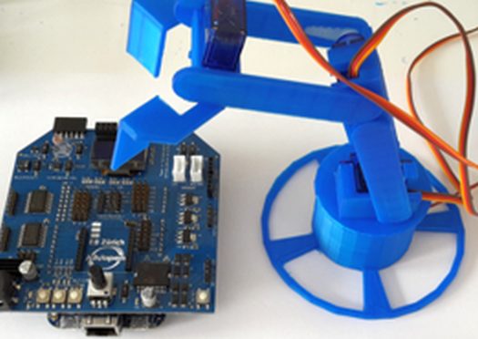

Roboter
-------

IoTKit mit Roboter Arm

- - -

Einen kleinen Roboter mit Hilfe eines Mikroprozessors zu steuern ist ganz einfach: Es braucht nur wenig Programmcode, um die elementaren Funktionen auszulösen. 

### Beispiele

* [Roboter Arm mittels Buttons bewegen](RoboterButton/)
* [Automatische Steuerung Roboter Arm](Roboter/)
* [Roboter Arm via HTTP Aufrufen steuern](RoboterRPC/)

### Links

* [Workshop: Das Internet der Dinge bewegt Roboter](http://iotkit.mc-b.ch/2016-06-04-IoTRoboter/)
* [CAD Teile Roboter Arm](https://github.com/mc-b/iotkitrobot)