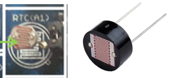

## [Licht Sensor](http://de.wikipedia.org/wiki/Fotowiderstand) 

 

photosensitive sensor auf Shield und Durchsteckmontage 

- - - 

Ein Fotowiderstand (englisch Light Dependent Resistor, LDR) ist ein Lichtabhängiger Widerstand aus einer amorphen Halbleiter-Schicht. Je höher der Lichteinfall, desto kleiner wird aufgrund des inneren fotoelektrischen Effekts sein elektrischer Widerstand.

Der Fotowiderstand kann nicht direkt mit einem analogen Pin verbunden werden, da dieser nur Spannungen und keine Widerstände messen kann. Die Lösung ist die die [Spannungsteiler](http://de.wikipedia.org/wiki/Spannungsteiler) Schaltung. Die Kombination Fotowiderstand und Spannungsteiler ergibt einen Licht Sensor.

### Anwendungen 

*   Dämmerungsschalter

### Links

*  [mbed OS V2 Variante](https://developer.mbed.org/compiler/#import:/teams/smdiotkitch/code/LichtSensor/)
