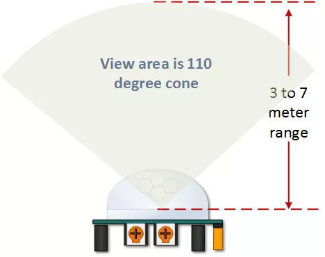
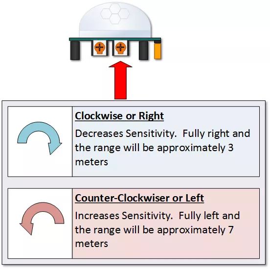
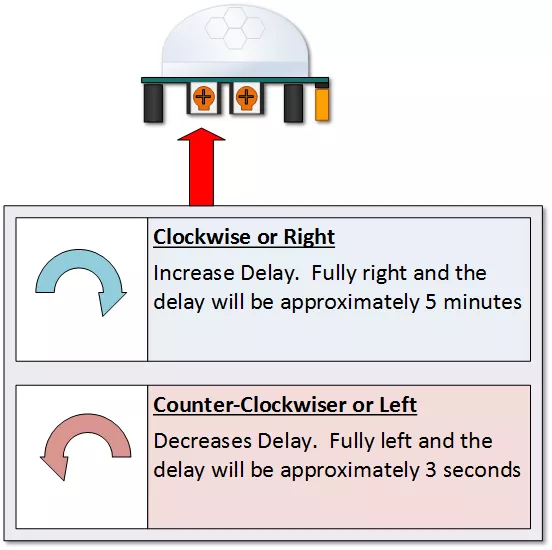
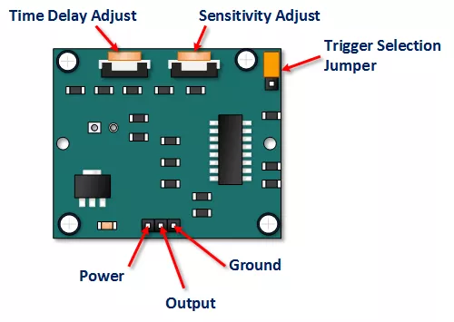

## [PIR Sensor (Bewegungsmelder)](http://de.wikipedia.org/wiki/Bewegungsmelder) 

Reichweite/Funktionsweise 

- - - 

 

Empfindlichkeit 3 - 7 Meter 

- - -

 

Signal von 3 Sekunden bis 5 Minuten

- - -

 

Anschlüsse

- - -

Ein Bewegungsmelder ist ein elektronischer Sensor, der Bewegungen in seiner näheren Umgebung erkennt und dadurch als elektrischer Schalter arbeiten kann. Ein Bewegungsmelder kann aktiv mit elektromagnetischen Wellen (HF oder Doppelradar), mit Ultraschall (Ultraschall-Bewegungsmelder) oder passiv anhand der Infrarotstrahlung der Umgebung arbeiten; es gibt auch Kombinationen davon.

Der PIR-Sensor (englisch passive infrared) ist der am häufigsten eingesetzte Typ von Bewegungsmeldern. Er reagiert optimal auf Winkeländerungen, wenn also eine Person am Sensor vorbeigeht. Der PIR Sensor wird mittels 3-adrigen Kabel mit dem Shield verbunden.

### Anwendungen

*   Einschalten einer Beleuchtung
*   Auslösen eines Alarms

### Anschlussbelegung (Sensor - Shield) 

*   VCC - V (5 Volt)
*   OUT - A5
*   GND - G (Ground)

### Links 

*   [Arduino HC-SR501 Motion Sensor Tutorial](http://henrysbench.capnfatz.com/henrys-bench/arduino-sensors-and-input/arduino-hc-sr501-motion-sensor-tutorial/#attachment wp-att-2120/0/)

### Links

*  [mbed OS V2 Variante](https://developer.mbed.org/compiler/#import:/teams/smdiotkitch/code/PIRSensor/)
