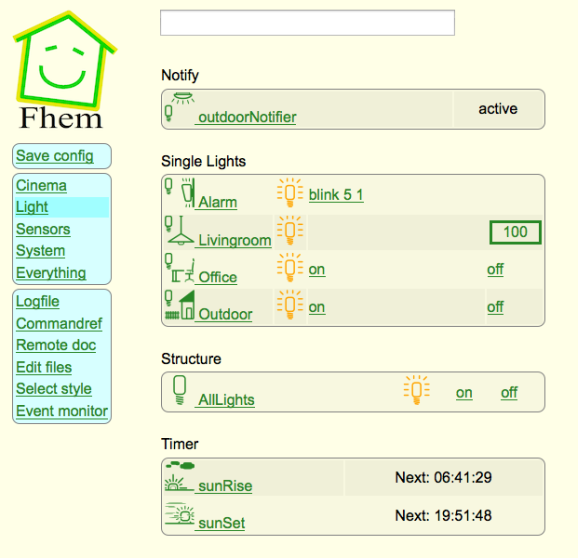

## FHEM

- - - 

[FHEM](http://fhem.de/fhem.html) ist ein in perl geschriebener, GPL lizensierter Server für die Heimautomatisierung. Man kann mit FHEM häufig auftretende Aufgaben automatisieren, wie z.Bsp. Lampen / Rollladen / Heizung / usw. schalten, oder Ereignisse wie Temperatur / Feuchtigkeit / Stromverbrauch protokollieren und visualisieren.

Das Programm läuft als Server, man kann es über WEB, dedizierte Smartphone Apps oder telnet bedienen, TCP Schnittstellen für JSON und XML existieren ebenfalls.

Um es zu verwenden benötigt man einen 24/7 Rechner (NAS, RPi, PC, MacMini, etc) mit einem perl Interpreter.

Ausgesprochen wird es wie fem.

### Links 

*   [Homepage](http://fhem.de)
*   [microHOME](https://github.com/mc-b/microHOME/wiki) erstes Projekt basierend auf FHEM und Raspberry Pi.

### Installation

	cd                        
	wget http://fhem.de/fhem-5.8.deb
	sudo dpkg -i fhem-5.8.deb
	sudo apt-get -f install

### User Interface 

*   Browser - [http://localhost:8083/fhem](http://localhost:8083/fhem)
*   Android - [andFHEM](http://andfhem.klass.li/)
*   iOS - Fhemobile oder [dhs-computertechnik](http://www.dhs-computertechnik.de/support-iphone.html)

### Linux Service

FHEM wird als Linux Service installiert und kann, wie folgt gestartet oder gestoppt werden:

	sudo service fhem start | stop

## Konfiguration FHEM

		
	define <name> <type> <type-specific>
	attr <devspec> <attrname> [<value>] 

Syntax Geräte und Attribute FHEM

- - -

Beispiel

	# LED on D11
	define LED1 dummy
	attr LED1 userattr Leds Leds_map structexclude
	attr LED1 Leds Led_All
	attr LED1 room Schlafzimmer
	attr LED1 setList on off
	define off_LED1 notify LED1:off { GetHttpFile("192.168.178.63", "/rpc/led1/write+0" ) }
	define on_LED1 notify LED1:on { GetHttpFile("192.168.178.63", "/rpc/led1/write+1" )  }
	
	# LED on D12
	define LED2 dummy
	attr LED2 userattr Leds Leds_map structexclude
	attr LED2 Leds Led_All
	attr LED2 room Schlafzimmer
	attr LED2 setList on off
	define off_LED2 notify LED2:off { GetHttpFile("192.168.178.63", "/rpc/led2/write+0" ) }
	define on_LED2 notify LED2:on { GetHttpFile("192.168.178.63", "/rpc/led2/write+1" )  }
	
	# Definiert eine Gruppe aller Led, welche gemeinsam ein/ausgeschaltet werden koennen
	define Led_All structure Leds LED1 LED2 
	attr Led_All room Schlafzimmer
	
	# Slider fuer LED Strip 
	define LED3_Slider dummy
	#attr LED3_Slider webCmd stop:up:0.9:0.8:0.7:0.6:0.5:0.4:0.3:0.2:0.1:down
	attr LED3_Slider webCmd state
	attr LED3_Slider setList state:slider,0,0.1,1.0
	attr LED3_Slider room Wohnzimmer
	
	# effektives Led mit PWM Signal
	define LED3 dummy
	attr LED3 stateFormat value
	
	# Verbindung Slider zum Led
	define Set_LED3_Slider notify LED3_Slider { GetHttpFile("192.168.178.63", "/rpc/led3/write+%" )  }

Mittels -> edit files -> fhem.cfg können weitere Geräte zu FHEM hinzugefügt werden. Dazu ist jedoch zuerst auf dem Eingabefeld oben **attr WEB editConfig 1** einzugeben und ENTER zu drücken.

Obiges Beispiel definiert 3 LED. Wobei 2 mit On/Off Schaltern und einer mit einem Slider Bedienungselement angezeigt wird.

Obiges Beispiel ist hinter die bestehenden Konfigurationseinstellungen anzufügen. Die bestehenden Einstellungen dürfen nicht überschrieben werden.

Das Gegenstück für das mbed Board ist [RPCHTTPServerSmartHomeV2](../mbedRPC/RPCHTTPServerSmartHomeV2/).

### Links 

*   [FHEM Befehlesreferenz](http://fhem.de/commandref_DE.html)
*   [FHEM für Einsteiger](http://fhem.de/Heimautomatisierung-mit-fhem.pdf)
*   [FHEM Wiki](http://www.fhemwiki.de/wiki/Hauptseite)
*   [Buttons und Sliders](http://www.fhemwiki.de/wiki/Slider_f%C3%BCr_HM-Rollladensteuerung_anzeigen)