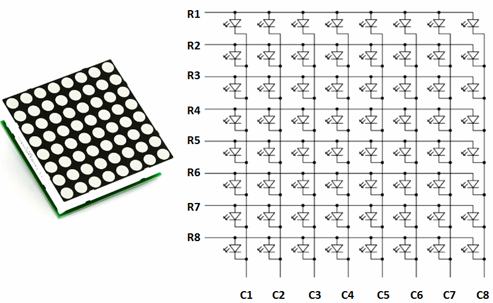

## Dot LED Matrix (SPI Stern)

 

Schaltplan Dot LED Matrix

- - -

Ein Punktmatrix-Display (Dot LED Matrix) ist ein Anzeigegerät um z.B. Fahrplaninformationen anzuzeigen.

Die Anzeige besteht aus einer Punktmatrix von LED&#039;s in einer rechteckigen Konfiguration angeordnet , so dass durch Zu- oder Abschalten der ausgewählten LED, Text oder Grafiken angezeigt werden können. Ein Punktmatrix-Controller wandelt Befehle von einem Prozessor in Signale (0, 1), so dass die gewünschte Anzeige erzeugt wird.

### Anwendungen 

*   Abfahrtszeiten von Zügen etc.
*   Fahrgast Informationen

### Anschlussbelegung (DotLEDMatrix - Shield) 

*   VCC - V (5 Volt)
*   GND - G (Ground)
*   DIN - MO (D11)
*   CS - D9
*   CLK - SCK (D13)

### Links

* [Arm Mbed Online Compiler](https://os.mbed.com/compiler/#import:/teams/IoTKitV3/code/DotLEDMatrix/)
* [Arm Mbed Online Compiler](https://os.mbed.com/compiler/#import:/teams/IoTKitV3/code/DotLEDMatrixLowLevel/)
