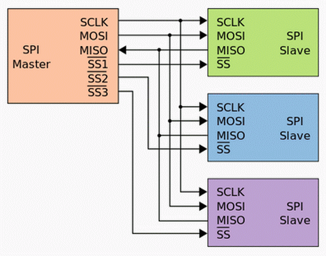
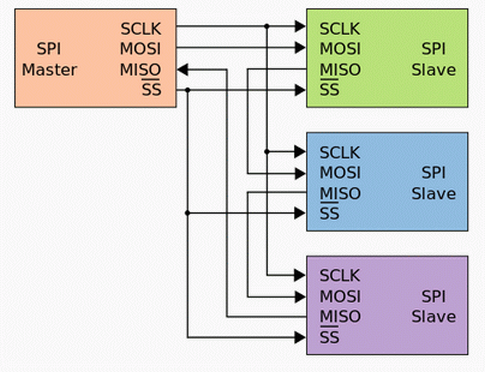

## SPI (Serial Peripheral Interface)

SPI Sternverbindung [Quelle Wikipedia](http://de.wikipedia.org/wiki/Serial_Peripheral_Interface)

- - -

 

SPI-Verbindung durch Kaskadierung der Slaves [Quelle Wikipedia](http://de.wikipedia.org/wiki/Serial_Peripheral_Interface) 

- - -

Das Serial Peripheral Interface (kurz SPI) ist ein von Motorola entwickeltes Bus-System mit einem **„lockeren“ Standard** für einen synchronen seriellen Datenbus (Synchronous Serial Port), mit dem digitale Schaltungen nach dem Master-Slave-Prinzip miteinander verbunden werden können.

Es gibt drei gemeinsame Leitungen, an denen jeder Teilnehmer angeschlossen ist:

*   **SCLK** (englisch Serial Clock) auch SCK, wird vom Master zur Synchronisation ausgegeben
*   **MOSI** (englisch Master Output, Slave Input) oder SIMO (englisch Slave Input, Master Output)
*   **MISO** (englisch Master Input, Slave Output) oder SOMI (englisch Slave Output, Master Input)

Die Datenleitungen werden manchmal auch SDO (englisch Serial Data Out) und SDI (englisch Serial Data In) genannt. Wobei die Benennung meistens aus der Sicht des jeweiligen Busteilnehmers erfolgt und entsprechend zu verbinden sind, Bsp: Master MOSI (Master Output) mit Slave MOSI (Slave Input).

Je nach Anordnung der Slaves wird eine (bei Kaskadierung) oder mehrere (bei Stern) Chip-Select-Leitungen, welche alle vom Master gesteuert werden, benötigt. Diese Leitungen werden unterschiedlich mit Bezeichnungen wie SS, CS oder STE für Slave Select, Chip Select oder Slave Transmit Enable bezeichnet.

An die [SPI-1 und SPI-2 Anschlüsse](../../../images/smdkit/spi.png), auf dem SMD Shield, können zwei SPI Geräte in Stern Anordnung angeschlossen werden.ACHTUNG: beim SPI-1 Header statt D8, z.B. A5 Pin verwenden.

### Anwendungen 

*   Zugriff auf [SD Karten](http://de.wikipedia.org/wiki/SD-Karte), [RFID Reader](http://de.wikipedia.org/wiki/RFID)
*   Ansteuerung von [LED Strip&#039;s](https://developer.mbed.org/components/Pololu-Addressable-RGB-LED-Strip/), [LCD Display&#039;s](http://developer.mbed.org/users/dreschpe/code/SPI_TFT_ILI9341/)

### Beispiele

* [Dot LED Matrix](DotLEDMatrix/), [Low Level Implementierung](DotLEDMatrixLowLevel/)
* [RGB LED Streifen - SPI Version, 5 Volt](RGBLEDStripSPI/), [Fernseh Simulator](FernsehSimulator/)
