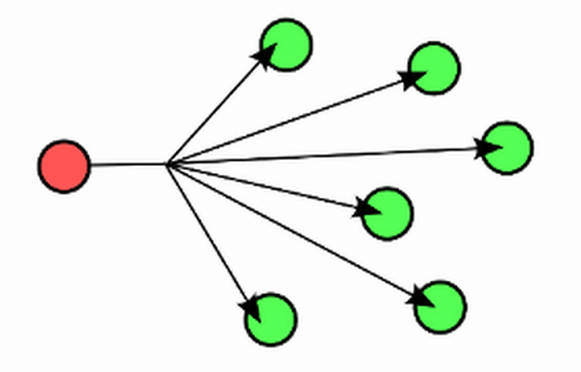

##  Broadcast 

Ein [Broadcast (engl.; „Rundfunk“)](http://de.wikipedia.org/wiki/Broadcast) in einem Computernetzwerk ist eine Nachricht, bei der Datenpakete von einem Punkt aus an alle Teilnehmer eines Nachrichtennetzes übertragen werden.

Ein Broadcast-Paket erreicht alle Teilnehmer eines lokalen Netzwerks, ohne dass sie explizit als Empfänger angegeben sind. Soll eine Information an eine Gruppe von ausgewählten Teilnehmern gesendet werden, verwendet man stattdessen ein [Multicast-Verfahren](http://de.wikipedia.org/wiki/Multicast).

Jeder Empfänger eines Broadcasts entscheidet selbst, ob er die erhaltene Nachricht verarbeitet oder stillschweigend verwirft.

### Anwendungen 

*   Meldung an alle anderen "Dinge" im Netzwerk wenn ein bestimmtes Ereignis Eintritt, z.B. Einsetzen der Dämmerung.

### Links

* [mbed OS V2 Variante](https://developer.mbed.org/compiler/#import:/users/mbed_official/code/BroadcastSend/)
* [mbed OS V2 Variante](https://developer.mbed.org/compiler/#import:/users/mbed_official/code/BroadcastReceive/)
