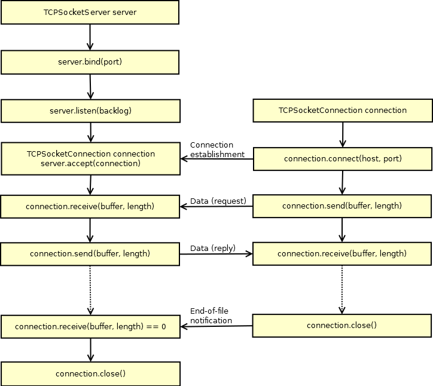
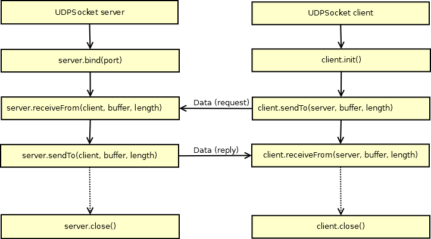

Netzwerke und Ports
-------------------

### TCP/IP (Internetprotokollfamilie)

<table width="100%" style="margin: auto; text-align: center;" border="1">
    <tr>
        <th class="hintergrundfarbe6">OSI-Schicht</th>
        <th class="hintergrundfarbe6">TCP/IP-Schicht</th>
        <th class="hintergrundfarbe6">Beispiel</th>
    </tr>
    <tr>
        <th class="hintergrundfarbe7">Anwendungen&#160;(7)</th>
        <td class="hintergrundfarbe7" rowspan="4">Anwendungen</td>
        <td class="hintergrundfarbe7" rowspan="3"><a
            href="http://de.wikipedia.org/wiki/Hypertext_Transfer_Protocol"
            title="Hypertext Transfer Protocol">HTTP</a>, <a
            href="http://de.wikipedia.org/wiki/File_Transfer_Protocol" title="File Transfer Protocol">FTP</a>,
            <a href="http://de.wikipedia.org/wiki/Simple_Mail_Transfer_Protocol"
            title="Simple Mail Transfer Protocol">SMTP</a>, <a
            href="http://de.wikipedia.org/wiki/Post_Office_Protocol" title="Post Office Protocol">POP</a>,
            <a href="http://de.wikipedia.org/wiki/Telnet" title="Telnet">Telnet</a></td>
    </tr>
    <tr>
        <th class="hintergrundfarbe7">Darstellung&#160;(6)</th>
    </tr>
    <tr>
        <th class="hintergrundfarbe7">Sitzung&#160;(5)</th>
    </tr>
    <tr>
        <td></td>
        <td class="hintergrundfarbe7"><a href="http://de.wikipedia.org/wiki/SOCKS" title="SOCKS">SOCKS</a></td>
    </tr>
    <tr>
        <th class="hintergrundfarbe9">Transport&#160;(4)</th>
        <td class="hintergrundfarbe9">Transport</td>
        <td class="hintergrundfarbe9"><a
            href="http://de.wikipedia.org/wiki/Transmission_Control_Protocol"
            title="Transmission Control Protocol"><b>TCP</b></a>, <a
            href="http://de.wikipedia.org/wiki/User_Datagram_Protocol" title="User Datagram Protocol"><b>UDP</b></td>
    </tr>
    <tr>
        <th class="hintergrundfarbe3">Vermittlung&#160;(3)</th>
        <td class="hintergrundfarbe3">Internet</td>
        <td class="hintergrundfarbe3"><a href="http://de.wikipedia.org/wiki/Internet_Protocol"
            title="Internet Protocol">IP</a> (<a href="http://de.wikipedia.org/wiki/IPv4" title="IPv4">IPv4</a>,
            <a href="http://de.wikipedia.org/wiki/IPv6" title="IPv6">IPv6</a>)</td>
    </tr>
    <tr>
        <th class="hintergrundfarbe4">Sicherung&#160;(2)</th>
        <td class="hintergrundfarbe4" rowspan="2">Netzzugang</td>
        <td class="hintergrundfarbe4" rowspan="2"><a href="http://de.wikipedia.org/wiki/Ethernet"
            title="Ethernet"><b>Ethernet</b></a>, <a
            href="http://de.wikipedia.org/wiki/Fiber_Distributed_Data_Interface"
            title="Fiber Distributed Data Interface">FDDI</a>, <a
            href="http://de.wikipedia.org/wiki/Wireless_Local_Area_Network"
            title="Wireless Local Area Network">Wifi/WLAN</a></td>
    </tr>
    <tr>
        <th class="hintergrundfarbe4">Bitübertragung&#160;(1)</th>
    </tr>
</table>

Quelle: [Wikipedia](http://de.wikipedia.org/wiki/Internetprotokollfamilie)

- - -

Transmission Control Protocol / Internet Protocol (TCP/IP) ist eine Familie von Netzwerkprotokollen und wird wegen ihrer großen Bedeutung für das Internet auch als Internetprotokollfamilie bezeichnet.

Ursprünglich wurde TCP als monolithisches Netzwerkprotokoll entwickelt, jedoch später in die Protokolle IP und TCP aufgeteilt. Die Kerngruppe der Protokollfamilie wird durch das User Datagram Protocol (UDP) als weiteres Transportprotokoll ergänzt. Außerdem gibt es zahlreiche Hilfs- und Anwendungsprotokolle, wie zum Beispiel [DHCP](http://de.wikipedia.org/wiki/Dynamic_Host_Configuration_Protocol) und [ARP](http://de.wikipedia.org/wiki/Address_Resolution_Protocol).

Die Identifizierung der am Netzwerk teilnehmenden Geräte geschieht über [IP-Adressen](http://de.wikipedia.org/wiki/IP-Adresse) (z.B. 10.10.32.1).

### IP-Adresse 

Netzwerke haben unterschiedliche Netzwerkadressen und jedes Geräte (Computer, mbed Board etc.) im Netzwerk eine eigene IP-Adresse.

Eine [IP-Adresse](https://de.wikipedia.org/wiki/IP-Adresse) ist eine Adresse in Computernetzen, die – wie das Internet – auf dem Internetprotokoll (IP) basiert. Sie wird Geräten zugewiesen, die an das Netz angebunden sind, und macht die Geräte so adressierbar und damit erreichbar. Die IP-Adresse kann einen einzelnen Empfänger oder eine Gruppe von Empfängern bezeichnen (Multicast, Broadcast). Umgekehrt kann einem Gerät mehrere IP-Adressen zugeordnet werden.

Die IP-Adresse wird verwendet, um Daten von ihrem Absender zum vorgesehenen Empfänger transportieren zu können. Ähnlich der Postanschrift auf einem Briefumschlag werden Datenpakete mit einer IP-Adresse versehen, die den Empfänger eindeutig identifiziert. Aufgrund dieser Adresse können die „Poststellen“, die [Router](https://de.wikipedia.org/wiki/Router), entscheiden, in welche Richtung das Paket weitertransportiert werden soll. Im Gegensatz zu Postadressen sind IP-Adressen nicht an einen bestimmten Ort gebunden.

Die bekannteste Notation der heute geläufigen IPv4-Adressen besteht aus vier Zahlen, die Werte von 0 bis 255 annehmen können und mit einem Punkt getrennt werden, beispielsweise **192.0.2.42.** Technisch gesehen ist die Adresse eine 32-stellige (IPv4) oder 128-stellige (IPv6) Binärzahl.

Die IP-Adressen **10.0.0.0 bis 10.255.255.255 und 192.168.0.0 bis 192.168.255.255** sind für den **privaten Bereich reserviert** und werden nicht ins Internet geroutet.

Für die Bildung von Teilnetzen siehe [Netzklassen (veraltet)](https://de.wikipedia.org/wiki/Netzklasse) und [Classless Inter-Domain Routing](https://de.wikipedia.org/wiki/Classless_Inter-Domain_Routing).

#### Port

Ein [Port](http://de.wikipedia.org/wiki/Port_(Protokoll)) ist der Teil einer IP-Adresse, der die Zuordnung von TCP- und UDP-Verbindungen und -Datenpaketen zu Server- und Client-Programmen durch Betriebssysteme bewirkt. Zu jeder Verbindung dieser beiden Protokolle gehören zwei Ports, je einer auf Seiten des Clients und des Servers. Gültige Portnummern sind 1-65535 bzw. richtiger 0-65535.

Ports dienen zwei Zwecken:

*   Primär sind Ports ein Merkmal zur Unterscheidung mehrerer Verbindungen zwischen demselben Paar von Endpunkten.
*   Ports können auch Netzwerkprotokolle und entsprechende Netzwerkdienste identifizieren, siehe [/etc/services bzw. C:/Windows/system32/Drivers/etc/services](http://www.penguintutor.com/linux/network-services-ports).

#### DHCP 

[Dynamic Host Configuration Protocol (DHCP)](https://de.wikipedia.org/wiki/Dynamic_Host_Configuration_Protocol) ermöglicht es, Computer ohne manuelle Konfiguration der Netzwerkschnittstelle in ein bestehendes Netzwerk einzubinden. DHCP verteilt Einstellungen wie IP-Adresse, Netzmaske, Gateway und Name Server (DNS) (je nach Netzwerktyp ggf. noch weitere Einstellungen) an die am Netzwerk angeschlossenen Computer.

#### DNS 

Das [Domain Name System (DNS)](https://de.wikipedia.org/wiki/Domain_Name_System) ist einer der wichtigsten Internet Dienste. Seine Hauptaufgabe ist die Beantwortung von Anfragen zur Namensauflösung.

Das DNS funktioniert ähnlich wie eine Telefonauskunft. Der Benutzer kennt die Domain (den für Menschen merkbaren Namen eines Rechners im Internet) – zum Beispiel example.org. Diese sendet er als Anfrage in das Internet. Diese Adresse wird dann dort vom DNS in die zugehörige IP-Adresse (die „Anschlussnummer“ im Internet) umgewandelt – zum Beispiel eine IPv4-Adresse der Form 192.0.2.42 oder eine IPv6-Adresse wie 2001:db8:85a3:8d3:1319:8a2e:370:7347, und führt so zum richtigen Gerät.

Es kann auch ohne DNS gearbeitet werden, dann sind die Namen der verfügbaren Geräte in die Datei /etc/hosts bzw. C:/Windows/system32/Drivers/etc/hosts einzutragen.

### Sockets

[Ablauf TCP Socket Kommunikation](https://developer.mbed.org/handbook/Socket)

- - -

 |

[Ablauf UDP Socket Kommunikation](https://developer.mbed.org/handbook/Socket)

- - -

Ein [Socket](http://de.wikipedia.org/wiki/Socket_(Software)) (abgeleitet von engl. Sockel oder Steckverbindung, Steckdose) ist ein Software-Modul, mit dessen Hilfe sich ein Computerprogramm mit einem Rechnernetz verbinden und mit anderen Computern Daten austauschen kann. Die Kommunikation über Sockets erfolgt in der Regel bidirektional. Das bedeutet, über das Socket können Daten sowohl empfangen als auch gesendet werden.

Generell kann man unterscheiden zwischen [TCP](http://de.wikipedia.org/wiki/Transmission_Control_Protocol) (Stream) Sockets und [UDP](http://de.wikipedia.org/wiki/User_Datagram_Protocol) (Datagram) Sockets.

Die [Ethernet Library](http://developer.mbed.org/users/mbed_official/code/EthernetInterface/) verwendet das [BSD (Berkeley Software Distribution) Sockets API](http://en.wikipedia.org/wiki/Berkeley_sockets).

### Anwendungen 

*   Fixe Zuteilung eines Port für einen Dienst oder Protokoll. Z.B. Port 80 für einen HTTP Server oder Port 25 für das Simple Mail Transfer Protocol (SMTP).
*   Öffnen eines weiteren Ports, z.B. von einem Browser, um eine Datei downzuladen.
*   Bidirektionale Kommunikation mit dem anderen Geräten, Anwendern, Servern etc., via TCP/IP

### Beispiele (mbed OS V2.x - ca. V5.3)

* [TCP Socket](TCPSocket_HelloWorld/)
* TCP Socket [Server](TCPEchoServer/) und [Client](TCPEchoClient/)
* [UDP Socket](UDPSocket_HelloWorld/)
* UCP Socket [Server](UDPEchoServer/) und [Client](UDPEchoClient/)
* UDP Broadcast [Empfangen](BroadcastReceive/) und [Senden](BroadcastSend/)
* [Mail verschicken](TCPSocket_Mail/)
* [MyLight System](UDPMyLightClient/)

### Beispiele (ab mbed OS V5.x)

* [Network Sockets on developer.mbed.org](https://docs.mbed.com/docs/mbed-os-api-reference/en/latest/APIs/communication/network_sockets/)
* [Websockets on developer.mbed.org](https://developer.mbed.org/cookbook/Websockets-Server)

