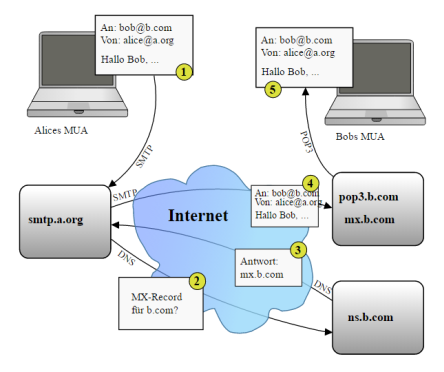

##  E-Mail

 

[Schematische Darstellung des prinzipiellen Ablaufs der Zustellung einer typischen E-Mail](https://de.wikipedia.org/wiki/E-Mail)

- - -

[E-Mail](https://de.wikipedia.org/wiki/E-Mail) ist zum einen ein System zur Computer-basierten Verwaltung von briefähnlichen Nachrichten und deren Übertragung über Computernetzwerke, insbesondere über das Internet. Zum anderen werden auch die auf diesem elektronischen Weg übertragenen Nachrichten selbst als E-Mails bezeichnet.

Die E-Mail Übertragung basiert auf TCP Streams und kann einfach nachgebildet werden.

### Links 

*   [Liste von Mail Transfer Agents](https://de.wikipedia.org/wiki/Mail_Transfer_Agent)
*   [Postfix Setup](https://help.ubuntu.com/community/PostfixBasicSetupHowto)

### Links

*  [mbed OS V2 Variante](https://developer.mbed.org/compiler/#import:/teams/smdiotkit2ch/code/TCPSocket_Mail/)
