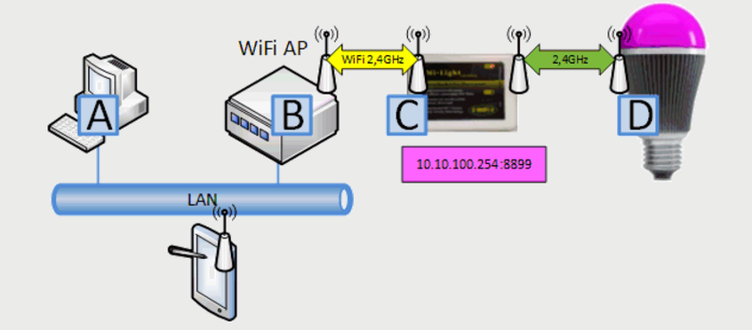

##  Mi Light

- - -

[Mi Light](http://www.milight.com/) ist ein intelligente und energieeffiziente mehrfarbige LED-Glühbirne, die via Smartphone gesteuert werden kann.

Mi Light besteht aus einem WiFi WLAN Controller, welcher via Funk Lampen und LED Strips steuert.

Die Kommunikation zum Wifi WLAN Controller erfolgt via UDP - [Details](http://www.msxfaq.de/lync/impresence/iwylight.htm)

### Anwendungen

*   Schalten von Lampen und LED Strips.

### Alternativen 

*   [Philips Hue](http://www2.meethue.com/de-CH)
*   [Osram](http://www.osram.ch/)

### Links

*  [mbed OS V2 Variante](https://developer.mbed.org/teams/smdiotkit2ch/code/UDPMyLightClient/)
