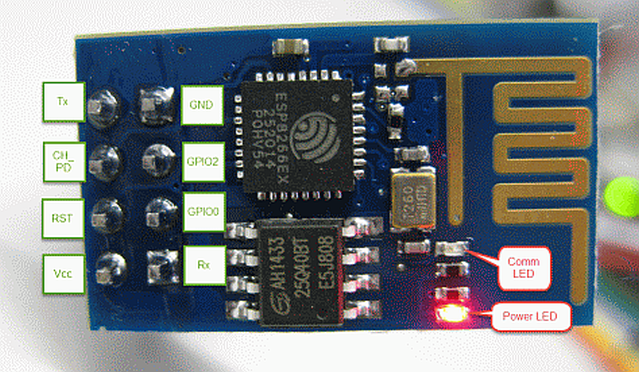

## ESP 8266 WLAN Modem (UART)

 

[ESP 8266 WLAN Modem](http://www.esp8266.com/wiki/doku.php)

- - -

Das ESP8266 Bauteil ist ein WLAN Modem welches über die Serielle Schnittstelle (UART) angesprochen werden kann.

Auf dem SMD Shield befindet sich oben rechts ein Steckplatz, wo das WLAN Modem eingesteckt und mittels Drahtbrücken mit einem UART auf dem mbed Board verbunden werden kann.

Dazu gibt es zwei Möglichkeiten:

*   Einstecken auf dem IoTKit Shield in der Mitte oben. Das Modem ist mit den Pin A2 und A3 (UART3) verbunden.
*   Manuelles verbinden der Stecker (oben) mit dem Serial Stecker (obere zwei Pin&#039;s). Das Modem ist mit den Pin D0 und D1 (USBTX, USBRX))) verbunden.

Weitere nützliche Informationen zum ESP8266 sind in diesem [Blog](https://orxor.wordpress.com/2015/01/30/esp8266-intro/) zu finden. Ausserdem existiert eine [ESP8266 Gruppe](https://developer.mbed.org/teams/ESP8266/).

Wenn das Modem nicht reagiert, Board 5 - 10 Sekunden vom USB und Strom trennen.

### WLAN Modem Konfiguration (UART)

Zum Konfigurieren eignet sich am Besten der PL2303HX Converter USB To RS232 TTL der wie folgt mit dem Modem zu verbinden ist:

*   Weises Kabel - mit TXD (Transmit - links neben dem Modem) verbinden
*   Grünes Kabel - mit RXD (Receive - rechts neben dem Modem) verbinden

Das Rote und Schwarze Kabel wird nicht benötigt. Die Baudrate ist auf 115200 einzustellen.

**SDK Version 1.x:**

Modem mit Access Point verbinden:

*   **AT+RST** - Reboot Modem
*   **AT+GMR** - Ausgabe SW Version
*   **AT+CWMODE=1** - WLAN Modem als Client (Station) konfigurieren
*   **AT+CWJAP="mcbmobile_2EX","android%123"** - mit Access Point mcbmobile_2EX verbinden
*   **AT+CIFSR** - Ausgabe der IP-Adresse

**SDK Version ab 1.5.4:**

Modem mit Access Point verbinden:

*   **AT+RST** - Reboot Modem
*   **AT+GMR** - Ausgabe SW Version
*   **AT+CWMODE=1** - WLAN Modem als Client (Station) konfigurieren
*   **AT+CWJAP_CUR="mcbmobile_2EX","android%123"** - mit Access Point mcbmobile_2EX verbinden
*   **AT+CIFSR** - Ausgabe der IP-Adresse

SDK Version 1.5.4 funktioniert mit mbed Library bzw. [Easy Connect](https://github.com/ARMmbed/easy-connect/) mit Patch von
[ESP8266.cpp](https://github.com/ARMmbed/esp8266-driver/blob/master/ESP8266/ESP8266.cpp), ca. Zeile 32 auf `return 2` ändern.

Beispiel Konfigurationsdatei `mbed_app.json` für ESP8266 für [Easy Connect](https://github.com/ARMmbed/easy-connect/) und IoTKit:

    "config": {
        "network-interface": {
            "help": "options are ETHERNET,WIFI_ESP8266,MESH_LOWPAN_ND,MESH_THREAD",
            "value": "WIFI_ESP8266"
        },
        "esp8266-tx": {
            "help": "Pin used as TX (connects to ESP8266 RX)",
            "value": "A3"
        },
        "esp8266-rx": {
            "help": "Pin used as RX (connects to ESP8266 TX)",
            "value": "A2"
        },
        "esp8266-debug": {
            "value": true
        }, 
        "wifi-ssid": {
            "value": "\"mcbmobile_2EX\""
        },
        "wifi-password": {
            "value": "\"android%123\""
        } 
    ...        

**Hinweis:** Alle Versuche die Firmware upzudaten, enden damit, dass das Board nicht mehr funktionsfähig ist. Deshalb ist es besser die Easy Connect Library zu patchen. 

### Links

* [Mikrocontroller.net](https://www.mikrocontroller.net/articles/ESP8266)
* [espressif Firmware](https://github.com/espressif/ESP8266_NONOS_SDK/tree/master/bin/at)
* [Verzeichnis AT Commandos.](https://room-15.github.io/blog/2015/03/26/esp8266-at-command-reference/)
* [Chip Hersteller](https://espressif.com/en)
* [Auführliche Beschreibung](https://playground.boxtec.ch/doku.php/wireless/esp8266)
*  [mbed OS V2 Variante](https://developer.mbed.org/compiler/#import:/teams/smdiotkit1ch/code/ESP8266/)
