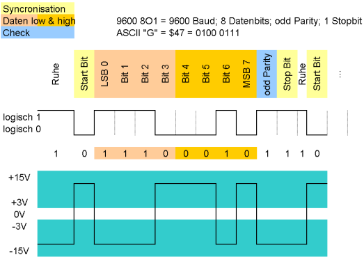

## UART (Universal Asynchronous Receiver Transmitter)
***

> [⇧ **Home**](../README.md)

Das untere Diagramm zeigt die dazu invertierten Spannungspegel auf der RS-232-Schnittstelle. [Quelle Wikipedia](http://de.wikipedia.org/wiki/Universal_Asynchronous_Receiver_Transmitter)

- - - 

Universal Asynchronous Receiver Transmitter, kurz UART, ist eine elektronische Schaltung, die zur Realisierung digitaler serieller Schnittstellen dient. Dabei kann es sich sowohl um ein eigenständiges elektronisches Bauelement (ein UART-Chip bzw. -Baustein) oder um einen Funktionsblock eines höherintegrierten Bauteils (z. B. eines Mikrocontrollers) handeln.

Eine UART-Schnittstelle dient zum Senden und Empfangen von Daten über eine Datenleitung und bildet den Standard der seriellen Schnittstellen an PCs und Mikrocontrollern. Auch im industriellen Bereich ist die Schnittstelle mit verschiedenen Interfaces (z. B. [RS-232](http://de.wikipedia.org/wiki/RS-232) oder [EIA-485](http://de.wikipedia.org/wiki/EIA-485)) sehr verbreitet.

Die Daten werden als serieller digitaler Datenstrom mit einem fixen Rahmen übertragen, der aus einem Start-Bit, fünf bis maximal neun Datenbits, einem optionalen Parity-Bit zur Erkennung von Übertragungsfehlern und einem Stopp-Bit besteht. Um dem Empfänger eine Synchronisationszeit auf den Takt der empfangenen Daten einzuräumen, kann das Stopp-Bit auf das 1,5 oder 2-fache der normalen Übertragungszeit eines Bits verlängert werden. Das wird als 1,5 bzw. 2 Stopp-Bits bezeichnet.

**In einfachen Mikrocontroller-Systemen werden Daten häufig über UART-Schnittstellen ausgetauscht, die ohne Handshake, nur über Rx und Tx, verwirklicht sind. Diese für kurze Entfernungen geeignete, auch [CMOS-UART bzw. TTL-UART](http://de.wikipedia.org/wiki/Logikpegel) genannte Implementierung wird von praktisch allen Mikrocontrollern unterstützt und kann bei entsprechend geringen Übertragungsraten auch über Software realisiert werden.**

Um den [CMOS-UART bzw. TTL-UART](http://de.wikipedia.org/wiki/Logikpegel) Pegel für den USB Bus verfügbar zu machen, kann ein [USB Serial Adapter](http://arduino.cc/en/Main/USBSerial) verwendet werden. Boards haben diesen, in der Regel, integriert (mbed - Ja, Arduino UNO - Ja, [Arduino Mini - Nein](http://www.arduino.cc/en/Main/ArduinoBoardMini) )

*Die Standardeinstellungen für den Seriellen Port (USB) sind 9600 baud, 8 bits, 1 stop bit, no parity (aka 9600-8-N-1).*

Um Daten auf die Serielle Schnittstelle auszugeben, sind keine zusätzlichen Objekte erforderlich. Die Serielle Schnittstelle wird automatisch geöffnet und Daten können mittels [printf](http://www.cplusplus.com/reference/cstdio/printf/) ausgegeben und mittels [scanf](http://www.cplusplus.com/reference/cstdio/scanf/) ausgelesen werden.

### Anwendungen 

* Ausgabe von Debug Informationen
* Fernsteuerung des Gerätes z.B. wie bei 3D Druckern
* Board - PC Kommunikation
* Ansprechen von Modems wie [Bluetooth](http://developer.mbed.org/platforms/FRDM-K64F/#features), [WLAN](https://os.mbed.com/questions/4993/How-to-interface-esp8266-wifi-module/), [GPS](http://developer.mbed.org/cookbook/GlobalSat-EM-406-GPS-Module)

### Beispiele

* [Serielle Ausgabe](Serialprintf/src/main.cpp) - demonstriert die verschiedenen Ausgabemöglichkeiten mit `printf`.
* [Serielle Eingabe](Serialscanf/src/main.cpp) - demonstriert die verschiedenen Eingabemöglichkeiten mit `scanf`. 
* [Serielle Schnittstelle](SerialAll/src/main.cpp) - Ausgabe, mittels `printf` auf allen Seriellen Schnittstelle des Boards. Muss für DISCO_L475VG_IOT01A angepasst werden.
* [Serial Master](SerialMaster/src/main.cpp), [Serial Slave](SerialSlave/src/main.cpp) - Kommunikation zwischen zwei Boards über die Serielle Schnittelle.
* [WLAN Modem ESP8266 lowlevel](ESP8266/src/main.cpp) - Ansprechen des ESP8266 WLAN Modems via AT-Befehlen (nur IoTKit K64F Board).

Für die Beispiele muss ein Terminalemulations Programm (siehe [Links](#links)) und für Windows 10 zusätzlich ein Treiber installiert werden. 

Die Konfiguration und der Firmware Update des ESP8266 WLAN Modems ist weiter [unten](#konfiguration-esp8266) beschrieben. 

**Compilieren**

| Umgebung/Board    | Link/Befehl                      |
| ----------------- | -------------------------------- |
| Online Compiler | [Serialprintf](https://developer.mbed.org/teams/smdiotkitch/code/Serialprintf/) |
| CLI (IoTKit K64F) | `mbed compile -m K64F --source . --source ../IoTKitV3/uart/Serialprintf; `   `cp BUILD/K64F/GCC_ARM/template.bin $DAPLINK` |
| CLI (DISCO_L475VG_IOT01A) | `mbed compile -m DISCO_L475VG_IOT01A -f --source . --source ../IoTKitV3/uart/Serialprintf` |
- - -
| Umgebung/Board    | Link/Befehl                      |
| ----------------- | -------------------------------- |
| Online Compiler | [Serialscanf](https://developer.mbed.org/teams/smdiotkitch/code/Serialscanf/) |
| CLI (IoTKit K64F) | `mbed compile -m K64F --source . --source ../IoTKitV3/uart/Serialscanf; `   `cp BUILD/K64F/GCC_ARM/template.bin $DAPLINK` |
| CLI (DISCO_L475VG_IOT01A) | `mbed compile -m DISCO_L475VG_IOT01A -f --source . --source ../IoTKitV3/uart/Serialscanf` |
- - -
| Umgebung/Board    | Link/Befehl                      |
| ----------------- | -------------------------------- |
| Online Compiler | [SerialAll](https://os.mbed.com/compiler/#import:/teams/IoTKitV3/code/SerialAll/) |
| CLI (IoTKit K64F) | `mbed compile -m K64F --source . --source ../IoTKitV3/uart/SerialAll; `   `cp BUILD/K64F/GCC_ARM/template.bin $DAPLINK` |
| CLI (DISCO_L475VG_IOT01A) | `mbed compile -m DISCO_L475VG_IOT01A -f --source . --source ../IoTKitV3/uart/SerialAll` |
- - -
| Umgebung/Board    | Link/Befehl                      |
| ----------------- | -------------------------------- |
| Online Compiler | [ESP8266](https://os.mbed.com/compiler/#import:/teams/IoTKitV3/code/ESP8266/) |
| CLI (IoTKit K64F) | `mbed compile -m K64F --source . --source ../IoTKitV3/uart/ESP8266; `   `cp BUILD/K64F/GCC_ARM/template.bin $DAPLINK` |
| CLI (DISCO_L475VG_IOT01A) | `mbed compile -m DISCO_L475VG_IOT01A -f --source . --source ../IoTKitV3/uart/ESP8266` |

### Links

* Terminalemulations Programme: [Windows](http://sourceforge.jp/projects/ttssh2/releases/), [Mac](http://freeware.the-meiers.org/), [Linux](http://manpages.ubuntu.com/manpages/vivid/man8/picocom.8.html)
* [PC Driver (nur Windows)](https://os.mbed.com/handbook/Windows-serial-configuration)
* [printf Reference](http://www.cplusplus.com/reference/cstdio/printf/)
* [scanf Reference](http://www.cplusplus.com/reference/cstdio/scanf/)

## Konfiguration ESP8266
***

Der IoTKit K64F wird mittels dem [ESP8266 WLAN Modem](https://de.wikipedia.org/wiki/ESP8266) ans Internet angeschlossen.

Ab mbed OS V5.10 ist der ESP8266 Driver Bestandteil von mbed und keine separate Library mehr. 

Um auf die neuste Version von mbed OS zu updaten ist wie folgt Vorzugehen:
* mbed-os - Library im Projekt löschen
* Mittels rechter Maustaste `Import Library ...` -> `From URL ...` anwählen
* Als URL [https://github.com/ARMmbed/mbed-os.git](https://github.com/ARMmbed/mbed-os.git) eintragen und Library importieren.

Der IoTKit V3 kommuniziert mittels UART mit dem [ESP8266](https://de.wikipedia.org/wiki/ESP8266) dabei werden folgende Pins verwendet:
* TX - PTC15
* RX = PTC14

Die eigentliche Konfiguration der Schnittstelle erfolgt in der Datei `mbed_app.json`. Die sehen Einträge wie folgt aus:

    {
        "config": {
            "wifi-shield": {
                "help": "Options are internal, WIFI_ESP8266, WIFI_ISM43362, WIFI_IDW0XX1",
                "value": "WIFI_ESP8266"
            },
            "wifi-ssid": {
                "help": "WiFi SSID",
                "value": "\"LERNKUBE\""
            },
            "wifi-password": {
                "help": "WiFi Password",
                "value": "\"l3rnk4b3\""
            },
            "wifi-tx": {
                "help": "TX pin for serial connection to external device",
                "value": "PTC15"
            },
            "wifi-rx": {
                "help": "RX pin for serial connection to external device",
                "value": "PTC14"
            },
            "wifi-debug": {
                "value": true
            }
        }
    }
   
Weitere nützliche Informationen zum ESP8266 sind in diesem [Blog](https://orxor.wordpress.com/2015/01/30/esp8266-intro/) zu finden. Ausserdem existiert eine [ESP8266 Gruppe](https://os.mbed.com/teams/ESP8266/).

### WLAN Modem Konfiguration (UART)

Zum Konfigurieren oder Update der Firmware eignet sich am Besten der PL2303HX Converter USB To RS232 TTL der wie folgt mit dem Modem zu verbinden ist:

*   Grünes Kabel - mit TXD0 (Transmit) verbinden
*   Weisses Kabel - mit RXD0 (Receive) verbinden

Das Rote und Schwarze Kabel wird nicht benötigt. Die Baudrate ist auf 115200 einzustellen.

**SDK Version ab 1.5.4:**

Modem mit Access Point verbinden:

*   **AT+RST** - Reboot Modem
*   **AT+GMR** - Ausgabe SW Version
*   **AT+CWMODE=1** - WLAN Modem als Client (Station) konfigurieren
*   **AT+CWJAP_CUR="mcbmobile_2EX","android%123"** - mit Access Point mcbmobile_2EX verbinden
*   **AT+CIFSR** - Ausgabe der IP-Adresse

#### Firmware Update

Dazu ist das Modem mit einem USB To RS232 TTL Converter zu Verbinden und eine Drahtbrücke von GND nach GPIO0 zu legen.

Die Software und Firmware wie in [ESP8266 Firmware Update](https://os.mbed.com/teams/ESP8266/wiki/Firmware-Update) beschrieben herunterladen.

Mittels eines Drahtes GND und RESET für eine Sekunde kurzschliessen und mittels des Flash Download Tools die Firmware updaten.

Die beschriebene Schaltung "serial passthrough" hat nicht funktioniert, so dass der Update mittels USB To RS232 TTL Converter erfolgt ist.
Auf der mbed MCU ist vorher ein einfaches Programm, z.B. DigitalOut zu uploaden, welche das ESP8266 nicht verwendet und auch nicht stört.

### Links

* [Mikrocontroller.net](https://www.mikrocontroller.net/articles/ESP8266)
* [espressif Firmware](https://github.com/espressif/ESP8266_NONOS_SDK/tree/master/bin/at)
* [Verzeichnis AT Commandos.](https://room-15.github.io/blog/2015/03/26/esp8266-at-command-reference/)
* [Chip Hersteller](https://espressif.com/en)
* [Auführliche Beschreibung](https://playground.boxtec.ch/doku.php/wireless/esp8266)

## Übungen
***

> [⇧ **Nach oben**](#)

| Übung                     | Lösung       |
| ------------------------- | ------------ |
| **AT Commands**, ändern Sie das [ESP8266](#beispiele) Beispiel so, dass Ihre Webseite geholt wird. |  |
| **ATCmdParser**, verwenden Sie den [ATCmdParser](https://os.mbed.com/docs/mbed-os/latest/apis/atcmdparser.html) von mbed um eine Webseite zu holen. | [Lösung](02-Uebung/src/main.cpp) |

### Compilieren

| Umgebung/Board    | Link/Befehl                      |
| ----------------- | -------------------------------- |
| Online Compiler | [template](https://os.mbed.com/compiler/#import:/teams/IoTKitV3/code/template/) Importieren und Inhalt von main.cpp mit Übungscode überschreiben |
| CLI (IoTKit K64F) | `mbed compile -m K64F --source . --source ../IoTKitV3/uart/02-Uebung; `   `cp BUILD/K64F/GCC_ARM/template.bin $DAPLINK` |
| CLI (DISCO_L475VG_IOT01A) | `mbed compile -m DISCO_L475VG_IOT01A -f --source . --source ../IoTKitV3/uart/02-Uebung` |

* *02-Uebung* durch entsprechendes Übung Verzeichnis *xx-Uebung* etc. ersetzen.