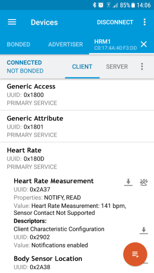

Wearables
---------

(Tragbare Computer), z.B. Armbanduhren, die ständig den Puls messen, Brillen, deren Innenseiten als Bildschirm dienen oder Kleidungsstücke, in die elektronische Hilfsmittel zur Kommunikation und Musikwiedergabe eingearbeitet sind.

### Beispiel Herzfrequenzmesser

nRF Connect App Printscreen

- - -

**Material:**
* mbed Bluetooth kompatibles Board wie
    * [micro:bit](https://developer.mbed.org/platforms/Microbit/)
    * [Seeed Arch BLE](https://developer.mbed.org/platforms/Seeed-Arch-BLE/)
* Smartphone mit nRF Connect App

**Installation**
* mbed Programm [BLE_HeartRate ](https://developer.mbed.org/teams/Bluetooth-Low-Energy/code/BLE_HeartRate/) auf mbed Board laden.
* nRF Connect App auf Smartphone starten und nRF Connect App starten.
* Nach neuen Geräten scannen.
* `HRM1` Gerät Verbinden und Herzfrequenz auslesen. 

### Beispiele (IoTKit)

* [Fitness Tracker](../i2c/FitnessTrackerV2/)
* [Bluetooth mbed - Smartphone Verbindung](../uart/Bluetooth_HC-06)

### Beispiele (micro:bit)

* [micro:bit Bluetooth](https://lancaster-university.github.io/microbit-docs/ble/profile/#pairing)
* [Bluetooth Home Page](https://www.bluetooth.com/)

### Links

* [mbed Bluetooth Team](https://developer.mbed.org/teams/Bluetooth-Low-Energy/)