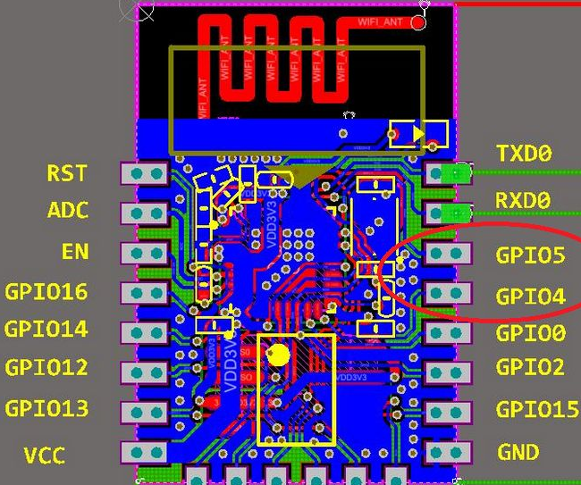

WLAN (WiFi)
-------------------

 

Handelsübliches ESP8266-Modul. Im oberen Bildbereich die gedruckte WLAN-Antenne

- - -

[Wireless Local Area Network](https://de.wikipedia.org/wiki/Wireless_Local_Area_Network) (Wireless LAN bzw. W-LAN, meist WLAN; deutsch drahtloses lokales Netzwerk) bezeichnet ein lokales Funknetz, wobei meist ein Standard der IEEE-802.11-Familie gemeint ist. Für diese engere Bedeutung ist in manchen Ländern (z. B. USA, Großbritannien, Kanada, Niederlande, Spanien, Frankreich, Italien) weitläufig beziehungsweise auch synonym der Begriff Wi-Fi gebräuchlich. 

Der IoTKit V3 wird mittels dem [ESP8266 WLAN Modem](https://de.wikipedia.org/wiki/ESP8266) ans Internet angeschlossen.

Weitere nützliche Informationen zum ESP8266 sind in diesem [Blog](https://orxor.wordpress.com/2015/01/30/esp8266-intro/) zu finden. Ausserdem existiert eine [ESP8266 Gruppe](https://os.mbed.com/teams/ESP8266/).

Ab mbed OS V5.10 ist der ESP8266 Driver Bestandteil von mbed und keine separate Library mehr. 

### Beispiele

* [WiFi](../uart/wifi/)
* [ESP8266 via AT-Befehlssatz ansprechen](../uart/ESP8266/)
* [NTP - Zeit setzen via Internet](NTPV2/)
* [Gegenüberstellung HTTP, MQTT, CoAP](https://os.mbed.com/blog/entry/Using-HTTP-HTTPS-MQTT-and-CoAP-from-mbed/)

### Konfiguration

Der IoTKit V3 kommuniziert mittels UART mit dem [ESP8266](https://de.wikipedia.org/wiki/ESP8266) dabei werden folgende Pins verwendet:
* TX - PTC15
* RX = PTC14

Die eigentliche Konfiguration der Schnittstelle erfolgt in der Datei `mbed_app.json`. Die sehen Einträge wie folgt aus:

	{
	    "config": {
	        "wifi-shield": {
	            "help": "Options are internal, WIFI_ESP8266, WIFI_ISM43362, WIFI_IDW0XX1",
	            "value": "WIFI_ESP8266"
	        },
	        "wifi-ssid": {
	            "help": "WiFi SSID",
	            "value": "\"LERNKUBE\""
	        },
	        "wifi-password": {
	            "help": "WiFi Password",
	            "value": "\"l3rnk4b3\""
	        },
	        "wifi-tx": {
	            "help": "TX pin for serial connection to external device",
	            "value": "PTC15"
	        },
	        "wifi-rx": {
	            "help": "RX pin for serial connection to external device",
	            "value": "PTC14"
	        },
	        "wifi-debug": {
	            "value": true
	        }
	    }
	}
          

### WLAN Modem Konfiguration (UART)

Zum Konfigurieren oder Update der Firmware eignet sich am Besten der PL2303HX Converter USB To RS232 TTL der wie folgt mit dem Modem zu verbinden ist:

*   Grünes Kabel - mit TXD0 (Transmit) verbinden
*   Weisses Kabel - mit RXD0 (Receive) verbinden

Das Rote und Schwarze Kabel wird nicht benötigt. Die Baudrate ist auf 115200 einzustellen.

**SDK Version ab 1.5.4:**

Modem mit Access Point verbinden:

*   **AT+RST** - Reboot Modem
*   **AT+GMR** - Ausgabe SW Version
*   **AT+CWMODE=1** - WLAN Modem als Client (Station) konfigurieren
*   **AT+CWJAP_CUR="mcbmobile_2EX","android%123"** - mit Access Point mcbmobile_2EX verbinden
*   **AT+CIFSR** - Ausgabe der IP-Adresse

#### Firmware Update

Dazu ist das Modem mit einem USB To RS232 TTL Converter zu Verbinden und eine Drahtbrücke von GND nach GPIO0 zu legen.

Die Software und Firmware wie in [ESP8266 Firmware Update](https://os.mbed.com/teams/ESP8266/wiki/Firmware-Update) beschrieben herunterladen.

Mittels eines Drahtes GND und RESET für eine Sekunde kurzschliessen und mittels des Flash Download Tools die Firmware updaten.

Die beschriebene Schaltung "serial passthrough" hat nicht funktioniert, so dass der Update mittels USB To RS232 TTL Converter erfolgt ist.
Auf der mbed MCU ist vorher ein einfaches Programm, z.B. DigitalOut zu uploaden, welche das ESP8266 nicht verwendet und auch nicht stört.

### Links

* [Mikrocontroller.net](https://www.mikrocontroller.net/articles/ESP8266)
* [espressif Firmware](https://github.com/espressif/ESP8266_NONOS_SDK/tree/master/bin/at)
* [Verzeichnis AT Commandos.](https://room-15.github.io/blog/2015/03/26/esp8266-at-command-reference/)
* [Chip Hersteller](https://espressif.com/en)
* [Auführliche Beschreibung](https://playground.boxtec.ch/doku.php/wireless/esp8266)
*  [Arm Mbed Online Compiler](https://os.mbed.com/compiler/#import:/teams/IoTKitV3/code/ESP8266/)