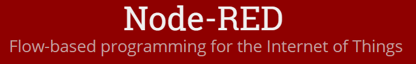
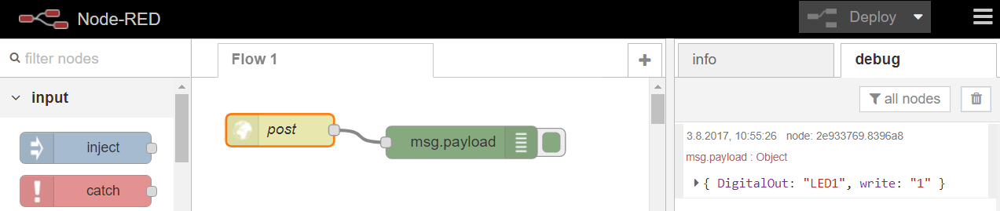
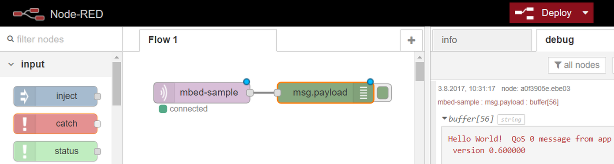

Workflow
--------

- - -

Mittels [Node-RED](https://nodered.org/) lassen sich einfache Workflows realisieren und die HTTP und MQTT Protokolle testen.

### Node-RED HTTP Workflow

- - -

* [Node-RED](https://nodered.org/) installieren.
* In Node-RED
    * `http` Input Node auf Flow 1 platzieren, mit als Methode `POST` und als URL `post` eintragen.
    * `debug` Output Node auf Flow 1 platzieren und mit Input Node verbinden.
    * Programm mittels `Deploy` veröffentlichen.
* mbed Teil
    * [HTTP POST](../http/HTTP_POST/) Beispiel (main.cpp) editieren und ca. auf Zeile 34 die URL mit dem Server ersetzen wo Node-RED läuft, z.B. `http://192.168.178.52:1880/post`. Port und Path nicht vergessen!
    * Programm Compilieren und auf Board laden.
    

### Node-RED MQTT Workflow

- - -

* [Mosquitto](https://mosquitto.org/) installieren.
* [Node-RED](https://nodered.org/) installieren.
* In Node-RED
    * `mqtt` Input Node auf Flow 1 platzieren, mit Mosquitto Server verbinden und als Topic `mbed-sample` eintragen.
    * `debug` Output Node auf Flow 1 platzieren und mit Input Node verbinden.
    * Programm mittels `Deploy` veröffentlichen.
* mbed Teil
    * [MQTT on developer.mbed.org](https://developer.mbed.org/teams/mqtt/code/HelloMQTT/) Beispiel in mbed Compiler importieren und ca. auf Zeile 80 den `hostname` mit der IP-Adresse auswechseln wo der Mosquitto Server läuft. 
    * Programm Compilieren und auf Board laden.

### Links
 
 * [Home Page](https://nodered.org/)
 * [Node-RED Einführung](https://www.youtube.com/watch?v=f5o4tIz2Zzc)
 